<div align="center">

<h2>🎓 NTUC Learning Hub SCTP : Associate Data Analyst</h2>

<p><b>Batch ID:</b> VLC-SCADF11-25-0655</p>
<p><b>Project:</b> 🎬 Machine Learning for Predictive Analysis of Movie IMDb Score</p>
<p><b>Name:</b> 👤 Marteus Yulianto</p>

</div>

-----------------------------------------
## Content:
* **1. Introduction**
* **2. Data Preparation / Exploration / Transformation**
    *  **2.1. Data Load**
    *  **2.2. Basic Exploration**
    *  **2.3. Remove Data Duplication**
    *  **2.4. Handling Data Missing and Column Removal**
          * **2.4.1. Column: `gross` and `budget`**
          * **2.4.2. Column: `aspect_ratio`**
          * **2.4.3. Column: `content_rating`**
          * **2.4.4. Column: `color`**
          * **2.4.5. Column: `language`**
          * **2.4.6. Impute other missing data columns**
          * **2.4.7. Column: `genres`**
          * **2.4.8. Column: `country`**
          * **2.4.9. Column: `movie title`**
          * **2.4.10. Remove columns**
          * **2.4.11. Data Correlation and Remove Multicollinearity columns**   
    *  **2.5. Data Descriptive**
          * **2.5.1. Current list of columns**
          * **2.5.2. Rearrange columns**
    *  **2.6. Data Statistics**
          * **2.6.1. Identify outlier columns**
          * **2.6.2. Top 5 outlier column and Boxplot**
* **3. Data Visualisation**
    * **3.1. Distribution of IMDb Score**
    * **3.2. Distribution of Released Movies**
    * **3.3. IMDb Score vs Content Rating**
    * **3.4. TOP 10 Profitable Movies**
    * **3.5. TOP 10 Movies by ROI(%)**
    * **3.6. TOP 10 Profitable Directors**
    * **3.7. TOP 10 IMDb Score Movies**
* **4. Machine Learning**
    * **4.1. Remove `movie_title` and `director_name`"**
    * **4.2. Binned `imdb_score`**
    * **4.3. Remove target feature**
    * **4.4. Convert Categorical to Numerical values**
    * **4.5. Feature Separation**
    * **4.6. Model and Splitting**
    * **4.7. Model Testing and Comparing Accuracies**
    * **4.8. Random Forest (the best model)**
        * **4.8.1. Classification Report and Confusion Matrix**
        * **4.8.2. Apply SMOTE (Synthetic Minority Over-sampling Technique)**
        * **4.8.3. Parameter Tuning**
        * **4.8.4. Weighting Features**
        * **4.8.5. Visualize of Features weight**
        * **4.8.6. Visualize of Selected Features**
* **5. Conclusion / Recommendation**
-----------------------------------------

<h1 style="font-size:2em;color:#2467C0">1. Introduction</h1>

## Problem Statement
**IMDb (Internet Movie Database)** is an online database of information related to films, television programs, home videos, and video games, and streaming content online -- including cast, production crew and personal biographies, plot summaries, trivia, fan reviews, and ratings.

The **IMDb score** (or IMDb rating) is a numerical rating assigned to movies, TV shows, and other video content on the Internet Movie Database (IMDb). It is designed to reflect how much audiences like or dislike a particular title. IMDb users rate movies on a scale from 1 to 10, where 1 = terrible and 10 = excellent. These ratings are not a simple average. IMDb uses weighted average algorithm to prevent manipulation by spam or biased voting. 

### IMDb Score Interpretation Guide

| IMDb Score | Interpretation          |
|------------|--------------------------|
| **9.0–10** | Masterpiece, all-time classic |
| **8.0–8.9** | Excellent               |
| **7.0–7.9** | Very good               |
| **6.0–6.9** | Good / Above average    |
| **5.0–5.9** | Average                 |
| **< 5.0**   | Below average to poor   |

A media analytics firm aims to understand the key factors influencing IMDb movie ratings. The goal is to analyze historical movie data and build a predictive model for **imdb_score** using features like budget, cast popularity, reviews, and more. Finally, it will boost profit or ROI (return on investment) in media industry. 


## Source Dataset
Here are the links to the data source and location:
* **Data Source:** movie_metadata.csv
* **Location:** [Kaggle - IMDB 5000 Movie Dataset](https://www.kaggle.com/datasets/carolzhangdc/imdb-5000-movie-dataset)


## Data Description
Inside the CSV files contains 28 variables for 5043 movies, we will use **imdb_score** as target variable while other 27 variables as possible predictors.

| Feature  Name            | Description                                                                                      |
| -----------------------  | -------------------------------------------------------------------------------------------------|
| movie_title              | Title of the Movie                                                                               |
| duration                 | Duration of the Movie (in minutes)                                                               |
| director_name            | Name of the Director of the Movie                                                                |
| director_facebook_likes  | Number of likes of the Director on his/her Facebook Page                                         |
| actor_1_name             | Primary actor of the movie                                                                       |
| actor_1_facebook_likes   | Number of likes of the primary actor on his/her Facebook Page                                    |
| actor_2_name             | Secondary actor of the movie                                                                     |
| actor_2_facebook_likes   | Number of likes of the secondary actor on his/her Facebook Page                                  |
| actor_3_name             | Third actor of the movie                                                                         |
| actor_3_facebook_likes   | Number of likes of the third actor on his/her Facebook Page                                      |
| num_user_for_reviews     | Number of users who gave a review                                                                |
| num_critic_for_reviews   | Number of critical reviews                                                                       |
| num_voted_users          | Number of people who voted for the movie                                                         |
| cast_total_facebook_likes| Total number of facebook likes of the entire cast of the movie                                   |
| movie_facebook_likes     | Number of Facebook likes in the movie page                                                       |
| plot_keywords            | Keywords describing the movie plot                                                               |
| facenumber_in_poster     | Number of the actor who featured in the movie poster                                             |
| color                    | Film colorization. 'Black and White' or 'Color'                                                  |
| genres                   | Film categorization like 'Animation', 'Comedy', 'Romance','Horror', 'Sci-Fi', 'Action', 'Family' |
| title_year               | The year in which the movie is released                                                          |
| language                 | English, Arabic, Chinese, French, German, Danish, Italian, Japanese etc                          |
| country                  | Country where the movie is produced                                                              |
| content_rating           | Content rating of the movie                                                                      |
| aspect_ratio             | Aspect ratio the movie was made in                                                               |
| movie_imdb_link          | IMDb link of the movie                                                                           |
| gross                    | Gross earnings of the movie (in US Dollar)                                                          |
| budget                   | Budget of the movie (in US Dollar)                                                                 |
| imdb_score               | IMDb Score of the movie in IMDB                                                                  |


<h1 style="font-size:2em;color:#2467C0">2. Data Preparation / Exploration / Transformation</h1>

* **2.1. Data Load**
* **2.2. Basic Exploration**
* **2.3. Remove Data Duplication**
* **2.4. Handling Data Missing and Column Removal**
    * **2.4.1. Column: `gross` and `budget`**
    * **2.4.2. Column: `aspect_ratio`**
    * **2.4.3. Column: `content_rating`**
    * **2.4.4. Column: `color`**
    * **2.4.5. Column: `language`**
    * **2.4.6. Impute other missing data columns**
    * **2.4.7. Column: `genres`**
    * **2.4.8. Column: `country`**
    * **2.4.9. Column: `movie title`**
    * **2.4.10. Remove columns**
    * **2.4.11. Data Correlation and Remove Multicollinearity columns** 
* **2.5. Data Descriptive**
    * **2.5.1. Current list of columns**
    * **2.5.2. Rearrange columns**
* **2.6. Data Statistics**
    * **2.6.1. Identify outlier columns**
    * **2.6.2. Top 5 outlier column and Boxplot**

## 2.1. Data Load


```python
# Importing the initial required libraries
import pandas as pd
import numpy as np
import matplotlib.pyplot as plt
import seaborn as sns

# To ignore the warnings that may appear
import warnings
warnings.filterwarnings("ignore")

# Load data
df_movies = pd.read_csv("movie_metadata.csv" , sep=',')
```

## 2.2. Basic Exploration


```python
# Understanding data
print("Dimension of the data:", df_movies.shape)

print("\n", "==" * 50, "\n")

print("Summary of the data:\n")
display(df_movies.info())

print("\n", "==" * 50, "\n")

print("Show data:\n")
display(df_movies.head())
```

:white_check_mark:Output  
    Dimension of the data: (5043, 28)
    
    ==================================================================================================== 
    
    Summary of the data:
    
    <class 'pandas.core.frame.DataFrame'>
    RangeIndex: 5043 entries, 0 to 5042
    Data columns (total 28 columns):
     #   Column                     Non-Null Count  Dtype  
    ---  ------                     --------------  -----  
     0   color                      5024 non-null   object 
     1   director_name              4939 non-null   object 
     2   num_critic_for_reviews     4993 non-null   float64
     3   duration                   5028 non-null   float64
     4   director_facebook_likes    4939 non-null   float64
     5   actor_3_facebook_likes     5020 non-null   float64
     6   actor_2_name               5030 non-null   object 
     7   actor_1_facebook_likes     5036 non-null   float64
     8   gross                      4159 non-null   float64
     9   genres                     5043 non-null   object 
     10  actor_1_name               5036 non-null   object 
     11  movie_title                5043 non-null   object 
     12  num_voted_users            5043 non-null   int64  
     13  cast_total_facebook_likes  5043 non-null   int64  
     14  actor_3_name               5020 non-null   object 
     15  facenumber_in_poster       5030 non-null   float64
     16  plot_keywords              4890 non-null   object 
     17  movie_imdb_link            5043 non-null   object 
     18  num_user_for_reviews       5022 non-null   float64
     19  language                   5029 non-null   object 
     20  country                    5038 non-null   object 
     21  content_rating             4740 non-null   object 
     22  budget                     4551 non-null   float64
     23  title_year                 4935 non-null   float64
     24  actor_2_facebook_likes     5030 non-null   float64
     25  imdb_score                 5043 non-null   float64
     26  aspect_ratio               4714 non-null   float64
     27  movie_facebook_likes       5043 non-null   int64  
    dtypes: float64(13), int64(3), object(12)
    memory usage: 1.1+ MB
    
    None

     ==================================================================================================== 
    
    Show data:
    
<div>
<table border="1" class="dataframe">
  <thead>
    <tr style="text-align: right;">
      <th></th>
      <th>color</th>
      <th>director_name</th>
      <th>num_critic_for_reviews</th>
      <th>duration</th>
      <th>director_facebook_likes</th>
      <th>actor_3_facebook_likes</th>
      <th>actor_2_name</th>
      <th>actor_1_facebook_likes</th>
      <th>gross</th>
      <th>genres</th>
      <th>...</th>
      <th>num_user_for_reviews</th>
      <th>language</th>
      <th>country</th>
      <th>content_rating</th>
      <th>budget</th>
      <th>title_year</th>
      <th>actor_2_facebook_likes</th>
      <th>imdb_score</th>
      <th>aspect_ratio</th>
      <th>movie_facebook_likes</th>
    </tr>
  </thead>
  <tbody>
    <tr>
      <th>0</th>
      <td>Color</td>
      <td>James Cameron</td>
      <td>723.0</td>
      <td>178.0</td>
      <td>0.0</td>
      <td>855.0</td>
      <td>Joel David Moore</td>
      <td>1000.0</td>
      <td>760505847.0</td>
      <td>Action|Adventure|Fantasy|Sci-Fi</td>
      <td>...</td>
      <td>3054.0</td>
      <td>English</td>
      <td>USA</td>
      <td>PG-13</td>
      <td>237000000.0</td>
      <td>2009.0</td>
      <td>936.0</td>
      <td>7.9</td>
      <td>1.78</td>
      <td>33000</td>
    </tr>
    <tr>
      <th>1</th>
      <td>Color</td>
      <td>Gore Verbinski</td>
      <td>302.0</td>
      <td>169.0</td>
      <td>563.0</td>
      <td>1000.0</td>
      <td>Orlando Bloom</td>
      <td>40000.0</td>
      <td>309404152.0</td>
      <td>Action|Adventure|Fantasy</td>
      <td>...</td>
      <td>1238.0</td>
      <td>English</td>
      <td>USA</td>
      <td>PG-13</td>
      <td>300000000.0</td>
      <td>2007.0</td>
      <td>5000.0</td>
      <td>7.1</td>
      <td>2.35</td>
      <td>0</td>
    </tr>
    <tr>
      <th>2</th>
      <td>Color</td>
      <td>Sam Mendes</td>
      <td>602.0</td>
      <td>148.0</td>
      <td>0.0</td>
      <td>161.0</td>
      <td>Rory Kinnear</td>
      <td>11000.0</td>
      <td>200074175.0</td>
      <td>Action|Adventure|Thriller</td>
      <td>...</td>
      <td>994.0</td>
      <td>English</td>
      <td>UK</td>
      <td>PG-13</td>
      <td>245000000.0</td>
      <td>2015.0</td>
      <td>393.0</td>
      <td>6.8</td>
      <td>2.35</td>
      <td>85000</td>
    </tr>
    <tr>
      <th>3</th>
      <td>Color</td>
      <td>Christopher Nolan</td>
      <td>813.0</td>
      <td>164.0</td>
      <td>22000.0</td>
      <td>23000.0</td>
      <td>Christian Bale</td>
      <td>27000.0</td>
      <td>448130642.0</td>
      <td>Action|Thriller</td>
      <td>...</td>
      <td>2701.0</td>
      <td>English</td>
      <td>USA</td>
      <td>PG-13</td>
      <td>250000000.0</td>
      <td>2012.0</td>
      <td>23000.0</td>
      <td>8.5</td>
      <td>2.35</td>
      <td>164000</td>
    </tr>
    <tr>
      <th>4</th>
      <td>NaN</td>
      <td>Doug Walker</td>
      <td>NaN</td>
      <td>NaN</td>
      <td>131.0</td>
      <td>NaN</td>
      <td>Rob Walker</td>
      <td>131.0</td>
      <td>NaN</td>
      <td>Documentary</td>
      <td>...</td>
      <td>NaN</td>
      <td>NaN</td>
      <td>NaN</td>
      <td>NaN</td>
      <td>NaN</td>
      <td>NaN</td>
      <td>12.0</td>
      <td>7.1</td>
      <td>NaN</td>
      <td>0</td>
    </tr>
  </tbody>
</table>
<p>5 rows × 28 columns</p>
</div>

## 2.3. Remove Data Duplication


```python
# Show number of duplicated rows
duplicate_count = df_movies.duplicated().sum()
print(f"Number of duplicate rows: {duplicate_count}")
```

:white_check_mark:Output  
   Number of duplicate rows: 45   


```python
# Remove duplicate rows
df_movies_no_duplicate = df_movies.drop_duplicates()
print("Dimension of the data:", df_movies_no_duplicate.shape)
```

:white_check_mark:Output  
    Dimension of the data: (4998, 28)
    

## 2.4. Handling data missing and column removal


```python
# Check Missing data
df_movies_no_duplicate.isnull().any()
```
:white_check_mark:Output  

    color                         True
    director_name                 True
    num_critic_for_reviews        True
    duration                      True
    director_facebook_likes       True
    actor_3_facebook_likes        True
    actor_2_name                  True
    actor_1_facebook_likes        True
    gross                         True
    genres                       False
    actor_1_name                  True
    movie_title                  False
    num_voted_users              False
    cast_total_facebook_likes    False
    actor_3_name                  True
    facenumber_in_poster          True
    plot_keywords                 True
    movie_imdb_link              False
    num_user_for_reviews          True
    language                      True
    country                       True
    content_rating                True
    budget                        True
    title_year                    True
    actor_2_facebook_likes        True
    imdb_score                   False
    aspect_ratio                  True
    movie_facebook_likes         False
    dtype: bool


```python
# Count missing values in each column
missing_counts = df_movies_no_duplicate.isna().sum().sort_values(ascending=False)

# Display the result
print(missing_counts)
```
:white_check_mark:Output  

    gross                        874
    budget                       487
    aspect_ratio                 327
    content_rating               301
    plot_keywords                152
    title_year                   107
    director_name                103
    director_facebook_likes      103
    num_critic_for_reviews        49
    actor_3_name                  23
    actor_3_facebook_likes        23
    num_user_for_reviews          21
    color                         19
    duration                      15
    language                      14
    facenumber_in_poster          13
    actor_2_name                  13
    actor_2_facebook_likes        13
    actor_1_name                   7
    actor_1_facebook_likes         7
    country                        5
    cast_total_facebook_likes      0
    num_voted_users                0
    movie_title                    0
    movie_imdb_link                0
    genres                         0
    imdb_score                     0
    movie_facebook_likes           0
    dtype: int64
    

### 2.4.1. column: `gross` and `budget`


```python
# 'gross' and 'budget' column have too many missing value. However, we want to keep these 2 columns for analysis.
# We can only delete null value for 'gross' and 'budget' because data imputation will not give good result.

# Remove rows where 'gross' or 'budget' is null
df_cleaned = df_movies_no_duplicate.dropna(subset=['gross', 'budget'])

# Get original row count
original_count = len(df_movies_no_duplicate)

# Get new row count
cleaned_count = len(df_cleaned)

# Calculate how many rows were removed
rows_removed = original_count - cleaned_count

# Calculate percentage of rows removed
percentage_removed = (rows_removed / original_count) * 100

# Print results
print(f"Original rows: {original_count}")
print(f"Rows after cleaning: {cleaned_count}")
print(f"Rows removed: {rows_removed}")
print(f"Percentage of rows removed: {percentage_removed:.2f}%")

print("Dimension of the data:", df_cleaned.shape)

# Count rows with no missing values
complete_cases_count = df_cleaned.dropna().shape[0]

# Display result
print("Number of complete cases (rows without any missing values):", complete_cases_count)

```
:white_check_mark:Output  
    Original rows: 4998
    Rows after cleaning: 3857
    Rows removed: 1141
    Percentage of rows removed: 22.83%
    Dimension of the data: (3857, 28)
    Number of complete cases (rows without any missing values): 3722
    


```python
# Count missing values in each column
missing_counts = df_cleaned.isna().sum().sort_values(ascending=False)

# Display the result
print(missing_counts)
```
:white_check_mark:Output  
    aspect_ratio                 74
    content_rating               51
    plot_keywords                31
    actor_3_name                 10
    actor_3_facebook_likes       10
    facenumber_in_poster          6
    actor_2_facebook_likes        5
    actor_2_name                  5
    language                      4
    actor_1_facebook_likes        3
    actor_1_name                  3
    color                         2
    duration                      1
    num_critic_for_reviews        1
    num_voted_users               0
    cast_total_facebook_likes     0
    director_name                 0
    movie_title                   0
    genres                        0
    movie_imdb_link               0
    num_user_for_reviews          0
    gross                         0
    country                       0
    director_facebook_likes       0
    budget                        0
    title_year                    0
    imdb_score                    0
    movie_facebook_likes          0
    dtype: int64
    

### 2.4.2. column: `aspect_ratio`


```python
# Frequency count of unique values in 'aspect_ratio' column
aspect_ratio_counts = df_cleaned['aspect_ratio'].value_counts(dropna=False)

# Display result
print(aspect_ratio_counts)
```
:white_check_mark:Output  
    aspect_ratio
    2.35     1995
    1.85     1600
    NaN        74
    1.37       50
    1.78       41
    1.66       40
    1.33       19
    2.39       11
    2.20       10
    2.00        3
    2.40        3
    2.76        3
    1.75        2
    1.18        1
    2.55        1
    1.77        1
    1.50        1
    2.24        1
    16.00       1
    Name: count, dtype: int64
    


```python
# The highest missing value count is at aspect_ratio 1.85 and 2.35
# Fill NA values in aspect_ratio with 0 to calculate 'Mean'
df_cleaned['aspect_ratio'] = df_cleaned['aspect_ratio'].fillna(0)

# Mean IMDb score where aspect_ratio == 1.85
mean_185 = df_cleaned.loc[df_cleaned['aspect_ratio'] == 1.85, 'imdb_score'].mean()

# Mean IMDb score where aspect_ratio == 2.35
mean_235 = df_cleaned.loc[df_cleaned['aspect_ratio'] == 2.35, 'imdb_score'].mean()

# Mean IMDb score where aspect_ratio is neither 1.85 nor 2.35
mean_other = df_cleaned.loc[(df_cleaned['aspect_ratio'] != 1.85) & (df_cleaned['aspect_ratio'] != 2.35), 'imdb_score'].mean()

# Display results
print("Mean IMDb score for aspect ratio 1.85:", round(mean_185, 2))
print("Mean IMDb score for aspect ratio 2.35:", round(mean_235, 2))
print("Mean IMDb score for other aspect ratios:", round(mean_other, 2))
```

    Mean IMDb score for aspect ratio 1.85: 6.37
    Mean IMDb score for aspect ratio 2.35: 6.51
    Mean IMDb score for other aspect ratios: 6.67
    


```python
# On aspect_ratio, the result shown that there is no significant difference of IMDb score.
# Conclusion: removing this column will not affect analysis.
del df_cleaned['aspect_ratio']
print("Dimension of the data:", df_cleaned.shape)
```

    Dimension of the data: (3857, 27)
    

### 2.4.3. column: `content_rating`


```python
# Display content_rating count
df_cleaned.groupby(['content_rating']).size()
```


    content_rating
    Approved       17
    G              91
    GP              1
    M               2
    NC-17           6
    Not Rated      42
    PG            573
    PG-13        1314
    Passed          3
    R            1723
    Unrated        24
    X              10
    dtype: int64


```python
# According to MPAA (https://en.wikipedia.org/wiki/Motion_Picture_Association_of_America_film_rating_system)
# M = GP = PG
# X = NC-17
# We will replace "Approved", "Not Rated", "Passed", "Unrated" with the most common rating "R"

df_cleaned.loc[df_cleaned['content_rating'] == 'M', 'content_rating'] = 'PG'
df_cleaned.loc[df_cleaned['content_rating'] == 'GP', 'content_rating'] = 'PG'
df_cleaned.loc[df_cleaned['content_rating'] == 'X', 'content_rating'] = 'NC-17'

df_cleaned.loc[df_cleaned['content_rating'] == 'Approved', 'content_rating'] = 'R'
df_cleaned.loc[df_cleaned['content_rating'] == 'Not Rated', 'content_rating'] = 'R'
df_cleaned.loc[df_cleaned['content_rating'] == 'Passed', 'content_rating'] = 'R'
df_cleaned.loc[df_cleaned['content_rating'] == 'Unrated', 'content_rating'] = 'R'

# Replace NaN values in 'content_rating' with 'R'
df_cleaned['content_rating'].fillna('R', inplace=True)

# Now we only have 5 different content ratings
df_cleaned.groupby(['content_rating']).size()
```


    content_rating
    G          91
    NC-17      16
    PG        576
    PG-13    1314
    R        1860
    dtype: int64


### 2.4.4. column: `color`


```python
# Disploy color count
df_cleaned.groupby(['color']).size()
```


    color
     Black and White     130
    Color               3725
    dtype: int64


```python
# Mostly movies are colored, which indicate that this column is nearly constant value. 
# We can remove this column.
del df_cleaned['color']
print("Dimension of the data:", df_cleaned.shape)
```

    Dimension of the data: (3857, 26)
    

### 2.4.5. column: `language`


```python
# Display language count
df_cleaned.groupby(['language']).size()
```


    language
    Aboriginal       2
    Arabic           1
    Aramaic          1
    Bosnian          1
    Cantonese        8
    Czech            1
    Danish           3
    Dari             2
    Dutch            3
    Dzongkha         1
    English       3674
    Filipino         1
    French          37
    German          13
    Hebrew           3
    Hindi           10
    Hungarian        1
    Icelandic        1
    Indonesian       2
    Italian          7
    Japanese        12
    Kazakh           1
    Korean           5
    Mandarin        14
    Maya             1
    Mongolian        1
    Norwegian        4
    Persian          3
    Portuguese       5
    Romanian         1
    Russian          1
    Spanish         26
    Swedish          1
    Telugu           1
    Thai             3
    Vietnamese       1
    Zulu             1
    dtype: int64


```python
# Mostly movies are in English, which means this variable is nearly constant. Let’s remove it.
del df_cleaned['language']
print("Dimension of the data:", df_cleaned.shape)
```

    Dimension of the data: (3857, 25)
    


```python
# Show current column names with their index numbers
for i, col in enumerate(df_cleaned.columns):
    print(f"{i}: {col}")
```

    0: director_name
    1: num_critic_for_reviews
    2: duration
    3: director_facebook_likes
    4: actor_3_facebook_likes
    5: actor_2_name
    6: actor_1_facebook_likes
    7: gross
    8: genres
    9: actor_1_name
    10: movie_title
    11: num_voted_users
    12: cast_total_facebook_likes
    13: actor_3_name
    14: facenumber_in_poster
    15: plot_keywords
    16: movie_imdb_link
    17: num_user_for_reviews
    18: country
    19: content_rating
    20: budget
    21: title_year
    22: actor_2_facebook_likes
    23: imdb_score
    24: movie_facebook_likes
    

### 2.4.6. Impute other missing data columns


```python
# 1. Replace NaN in 'facenumber_in_poster' with the column's mean (rounded)
mean_face = round(df_cleaned['facenumber_in_poster'].mean(skipna=True))
df_cleaned['facenumber_in_poster'].fillna(mean_face, inplace=True)

# 2. Replace 0s with NaN for columns (by index):
    # 3: director_facebook_likes
    # 4: actor_3_facebook_likes
    # 6: actor_1_facebook_likes
    # 12: cast_total_facebook_likes
    # 22: actor_2_facebook_likes
    # 24: movie_facebook_likes
columns_to_convert = df_cleaned.columns[[3, 4, 6, 12, 22, 24]]
df_cleaned[columns_to_convert] = df_cleaned[columns_to_convert].replace(0, np.nan)

# 3. Impute missing values with mean for the specified columns
columns_to_impute = [
    'num_critic_for_reviews', 'duration', 'director_facebook_likes',
    'actor_3_facebook_likes', 'actor_1_facebook_likes',
    'cast_total_facebook_likes', 'actor_2_facebook_likes',
    'movie_facebook_likes']
for col in columns_to_impute:
    mean_val = round(df_cleaned[col].mean(skipna=True))
    df_cleaned[col].fillna(mean_val, inplace=True)

```

### 2.4.7. column: `genres`


```python
# show 'genres' column
print(df_movies_no_duplicate['genres'].head())
```

    0    Action|Adventure|Fantasy|Sci-Fi
    1           Action|Adventure|Fantasy
    2          Action|Adventure|Thriller
    3                    Action|Thriller
    4                        Documentary
    Name: genres, dtype: object
    


```python
# There are many genres in 1 column and it will be difficult to analyze. 
# We will try to check the relationship between genres and IMDb score.

# Extract relevant columns
genres_df = df_movies_no_duplicate[['genres', 'imdb_score']].dropna(subset=['genres', 'imdb_score'])

# Define all possible genres
all_genres = [
    "Action", "Adventure", "Animation", "Biography", "Comedy", "Crime", "Documentary", "Drama",
    "Family", "Fantasy", "Film-Noir", "History", "Horror", "Musical", "Mystery", "News",
    "Romance", "Sci-Fi", "Short", "Sport", "Thriller", "War", "Western"
]

# Create one-hot encoded columns for each genre
for genre in all_genres:
    genres_df[genre] = genres_df['genres'].apply(lambda x: 1 if genre in x else 0)

# Calculate the mean imdb_score per genre
mean_scores = {
    genre: genres_df.loc[genres_df[genre] == 1, 'imdb_score'].mean()
    for genre in all_genres
}

# Calculate the average of all the genre-specific mean IMDb scores
overall_average = np.mean(list(mean_scores.values()))

# Display the result
print("Overall Average IMDb Score Across All Genres:", round(overall_average, 2))

# Step 6: Plot the results
plt.figure(figsize=(12, 6))
plt.bar(mean_scores.keys(), mean_scores.values())
plt.xticks(rotation=45, ha='right')
plt.ylabel("Average IMDb Score")
plt.title("Average IMDb Scores for Different Genres")
plt.tight_layout()
plt.show()

```

    Overall Average IMDb Score Across All Genres: 6.63
    


    
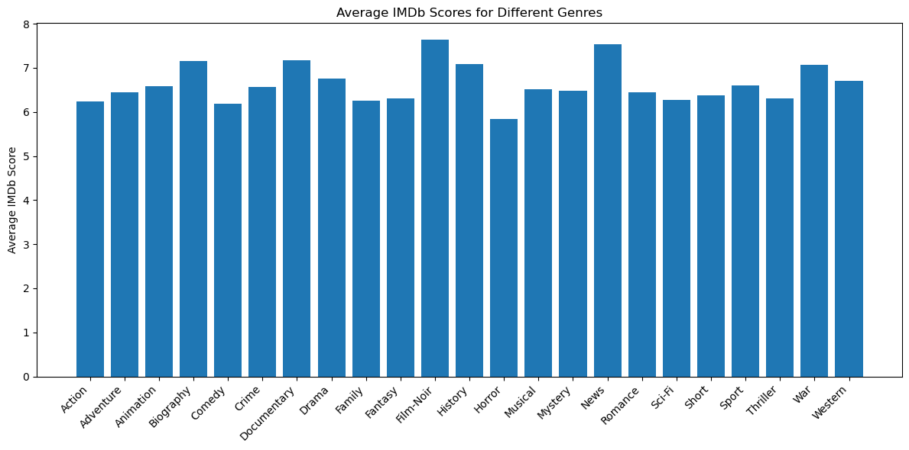
    


```python
# As you can see on above bar chart that the average IMDb score per genre mostly fall between 6 and 8.
# it's only minor variations across genres and has little to no predictive power. 
# We can decide to remove 'genres' column
del df_cleaned['genres']
print("Dimension of the data:", df_cleaned.shape)
```

    Dimension of the data: (3857, 24)
    

### 2.4.8. column: `country`


```python
# Is Country an important factor for imdb score?
df_cleaned.groupby(['country']).size()
```


    country
    Afghanistan          1
    Argentina            3
    Aruba                1
    Australia           41
    Belgium              2
    Brazil               5
    Canada              64
    Chile                1
    China               14
    Colombia             1
    Czech Republic       3
    Denmark              9
    Finland              1
    France             106
    Georgia              1
    Germany             81
    Greece               1
    Hong Kong           13
    Hungary              2
    Iceland              2
    India               14
    Indonesia            1
    Iran                 4
    Ireland              7
    Israel               3
    Italy               11
    Japan               17
    Mexico              11
    Netherlands          3
    New Line             1
    New Zealand         11
    Norway               4
    Official site        1
    Peru                 1
    Philippines          1
    Poland               1
    Romania              2
    Russia               3
    South Africa         3
    South Korea          9
    Spain               22
    Sweden               1
    Taiwan               2
    Thailand             4
    UK                 320
    USA               3047
    West Germany         1
    dtype: int64


```python
# Step 1 & 2: Replace all countries except 'USA' and 'UK' with 'Others'
df_cleaned['country'] = df_cleaned['country'].apply(lambda x: x if x in ['USA', 'UK'] else 'Others')

# Step 3: Convert to category (similar to factor in R)
df_cleaned['country'] = df_cleaned['country'].astype('category')

df_cleaned.groupby(['country']).size()
```


    country
    Others     490
    UK         320
    USA       3047
    dtype: int64


```python
# Even though we group for other countries besides 'USA' and 'UK', Country 'USA' has dominant value.
# It shows low variance column for country and we decided to remove it to improve model performance. 
del df_cleaned['country']
print("Dimension of the data:", df_cleaned.shape)
```

    Dimension of the data: (3857, 23)
    

### 2.4.9. column: `movie title`


```python
# Remove "Â" from movie titles
df_cleaned['movie_title'] = df_cleaned['movie_title'].str.replace('Â', '', regex=False)

# Strip any leftover whitespace
df_cleaned['movie_title'] = df_cleaned['movie_title'].str.strip()

# Preview the result
print(df_cleaned['movie_title'].head())
```

    0                                      Avatar
    1    Pirates of the Caribbean: At World's End
    2                                     Spectre
    3                       The Dark Knight Rises
    5                                 John Carter
    Name: movie_title, dtype: object
    

### 2.4.10. Remove unrelevant columns


```python
# Remove unrelevant columns to IMDb score due to high cardinality (hundreds or thousands of unique keywords combinations)
del df_cleaned['actor_1_name']
del df_cleaned['actor_2_name']
del df_cleaned['actor_3_name']
del df_cleaned['plot_keywords']
del df_cleaned['movie_imdb_link']

# Check the result
print("Dimension of the data:", df_cleaned.shape)
```

    Dimension of the data: (3857, 18)
    

### 2.4.11. Data Correlation and Remove Multicollinearity columns


```python
# Only keep numeric columns (automatically excludes 'movie_title' and other strings)
corrmat = df_cleaned.corr(numeric_only=True)
plt.figure(figsize = (10,7))
top_corr_features = corrmat.index[abs(corrmat["imdb_score"])>0.1]
g = sns.heatmap(corrmat,annot=True,cmap="RdYlGn")
```


    
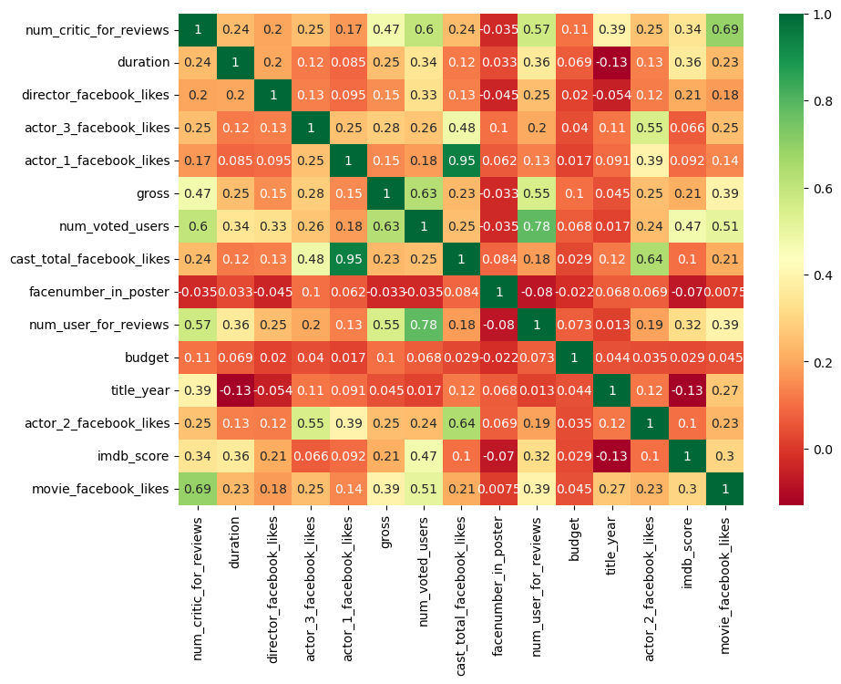
    


- Based on the headmap, we can see some high correlations (> 0.7) variables (multicollinearity)
- The highest correlation value is 0.95 (actor_1_facebook_likes is highly correlated with the cast_total_facebook_likes)
- We will keep actor_1_facebook_likes and remove cast_total_facebook_likes


```python
del df_cleaned['cast_total_facebook_likes']
print("Dimension of the data:", df_cleaned.shape)
```

    Dimension of the data: (3857, 17)
    

- The second highest correlation value is 0.78 (num_voted_users is hightly correlated with num_user_for_reviews)
- We want to keep num_voted_users as it's important factor for IMDb score and take ratio of num_critic_for_reviews and num_user_for_reviews to reduce high correlation


```python
# 3-decimal float column and guard against divide-by-zero
ratio = df_cleaned['num_critic_for_reviews'] / df_cleaned['num_user_for_reviews'].replace(0, np.nan)
df_cleaned['critic_review_ratio'] = ratio.replace([np.inf, -np.inf], np.nan).round(3)
```

- Both actor_2_facebook_likes (0.64) and actor3_facebook_likes (0.48) are also somehow correlated to the cast_total_facebook_likes.
- We will group these 2 actors into other_actors_facebook_likes to reduce high correlation.


```python
df_cleaned['other_actors_facebook_likes'] = df_cleaned['actor_2_facebook_likes'] + df_cleaned['actor_3_facebook_likes']
```


```python
# Remove unnecessary columns
del df_cleaned['actor_2_facebook_likes']
del df_cleaned['actor_3_facebook_likes']
del df_cleaned['num_critic_for_reviews']
del df_cleaned['num_user_for_reviews']

print("Dimension of the data:", df_cleaned.shape)
```

    Dimension of the data: (3857, 15)
    


```python
# Result after remove multicollinearity variables (no more high correlation > 0.7)
corrmat = df_cleaned.corr(numeric_only=True)
plt.figure(figsize = (10,7))
top_corr_features = corrmat.index[abs(corrmat["imdb_score"])>0.1]
g = sns.heatmap(corrmat,annot=True,cmap="RdYlGn")
```


    
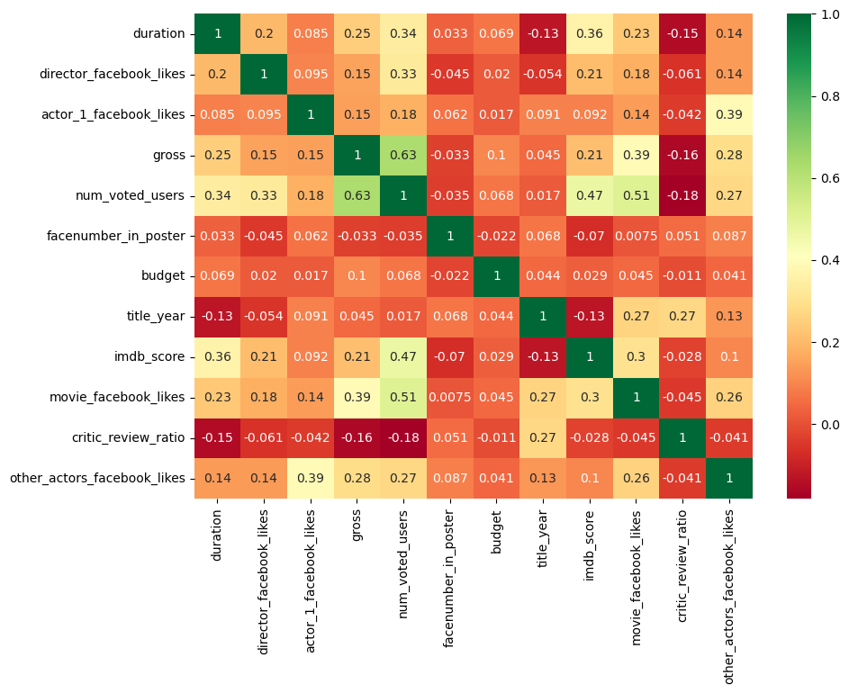
    


```python
# FINAL CHECK MISSING DATA
# Count current missing values in each column
missing_counts = df_cleaned.isna().sum().sort_values(ascending=False)

# Display remaining missing data
print(missing_counts)
```

    director_name                  0
    duration                       0
    director_facebook_likes        0
    actor_1_facebook_likes         0
    gross                          0
    movie_title                    0
    num_voted_users                0
    facenumber_in_poster           0
    content_rating                 0
    budget                         0
    title_year                     0
    imdb_score                     0
    movie_facebook_likes           0
    critic_review_ratio            0
    other_actors_facebook_likes    0
    dtype: int64
    

## 2.5. Data Descriptive

### 2.5.1. Current list of columns


```python
# Show current column names with their index numbers
for i, col in enumerate(df_cleaned.columns):
    print(f"{i}: {col}")
```

    0: director_name
    1: duration
    2: director_facebook_likes
    3: actor_1_facebook_likes
    4: gross
    5: movie_title
    6: num_voted_users
    7: facenumber_in_poster
    8: content_rating
    9: budget
    10: title_year
    11: imdb_score
    12: movie_facebook_likes
    13: critic_review_ratio
    14: other_actors_facebook_likes
    

### 2.5.2. Rearrange columns


```python
# Rearrange column order
df_cleaned_final= df_cleaned[['movie_title','director_name','movie_facebook_likes','director_facebook_likes',
                              'actor_1_facebook_likes','other_actors_facebook_likes','critic_review_ratio', 
                              'num_voted_users','budget','gross','facenumber_in_poster',
                              'content_rating','duration','title_year','imdb_score']]

# Show current column names with their index numbers
for i, col in enumerate(df_cleaned_final.columns):
    print(f"{i}: {col}")
    
df_cleaned_final.head(5)
```

    0: movie_title
    1: director_name
    2: movie_facebook_likes
    3: director_facebook_likes
    4: actor_1_facebook_likes
    5: other_actors_facebook_likes
    6: critic_review_ratio
    7: num_voted_users
    8: budget
    9: gross
    10: facenumber_in_poster
    11: content_rating
    12: duration
    13: title_year
    14: imdb_score
    


<div>
<table border="1" class="dataframe">
  <thead>
    <tr style="text-align: right;">
      <th></th>
      <th>movie_title</th>
      <th>director_name</th>
      <th>movie_facebook_likes</th>
      <th>director_facebook_likes</th>
      <th>actor_1_facebook_likes</th>
      <th>other_actors_facebook_likes</th>
      <th>critic_review_ratio</th>
      <th>num_voted_users</th>
      <th>budget</th>
      <th>gross</th>
      <th>facenumber_in_poster</th>
      <th>content_rating</th>
      <th>duration</th>
      <th>title_year</th>
      <th>imdb_score</th>
    </tr>
  </thead>
  <tbody>
    <tr>
      <th>0</th>
      <td>Avatar</td>
      <td>James Cameron</td>
      <td>33000.0</td>
      <td>949.0</td>
      <td>1000.0</td>
      <td>1791.0</td>
      <td>0.237</td>
      <td>886204</td>
      <td>237000000.0</td>
      <td>760505847.0</td>
      <td>0.0</td>
      <td>PG-13</td>
      <td>178.0</td>
      <td>2009.0</td>
      <td>7.9</td>
    </tr>
    <tr>
      <th>1</th>
      <td>Pirates of the Caribbean: At World's End</td>
      <td>Gore Verbinski</td>
      <td>16720.0</td>
      <td>563.0</td>
      <td>40000.0</td>
      <td>6000.0</td>
      <td>0.244</td>
      <td>471220</td>
      <td>300000000.0</td>
      <td>309404152.0</td>
      <td>0.0</td>
      <td>PG-13</td>
      <td>169.0</td>
      <td>2007.0</td>
      <td>7.1</td>
    </tr>
    <tr>
      <th>2</th>
      <td>Spectre</td>
      <td>Sam Mendes</td>
      <td>85000.0</td>
      <td>949.0</td>
      <td>11000.0</td>
      <td>554.0</td>
      <td>0.606</td>
      <td>275868</td>
      <td>245000000.0</td>
      <td>200074175.0</td>
      <td>1.0</td>
      <td>PG-13</td>
      <td>148.0</td>
      <td>2015.0</td>
      <td>6.8</td>
    </tr>
    <tr>
      <th>3</th>
      <td>The Dark Knight Rises</td>
      <td>Christopher Nolan</td>
      <td>164000.0</td>
      <td>22000.0</td>
      <td>27000.0</td>
      <td>46000.0</td>
      <td>0.301</td>
      <td>1144337</td>
      <td>250000000.0</td>
      <td>448130642.0</td>
      <td>0.0</td>
      <td>PG-13</td>
      <td>164.0</td>
      <td>2012.0</td>
      <td>8.5</td>
    </tr>
    <tr>
      <th>5</th>
      <td>John Carter</td>
      <td>Andrew Stanton</td>
      <td>24000.0</td>
      <td>475.0</td>
      <td>640.0</td>
      <td>1162.0</td>
      <td>0.626</td>
      <td>212204</td>
      <td>263700000.0</td>
      <td>73058679.0</td>
      <td>1.0</td>
      <td>PG-13</td>
      <td>132.0</td>
      <td>2012.0</td>
      <td>6.6</td>
    </tr>
  </tbody>
</table>
</div>


```python
# Save the cleaned DataFrame to a new CSV file
df_cleaned_final.to_csv("movie_metadata_cleaned.csv", index=False)
```

## 2.6. Data Statistics


```python
df_cleaned_final.describe()
```


<div>
<table border="1" class="dataframe">
  <thead>
    <tr style="text-align: right;">
      <th></th>
      <th>movie_facebook_likes</th>
      <th>director_facebook_likes</th>
      <th>actor_1_facebook_likes</th>
      <th>other_actors_facebook_likes</th>
      <th>critic_review_ratio</th>
      <th>num_voted_users</th>
      <th>budget</th>
      <th>gross</th>
      <th>facenumber_in_poster</th>
      <th>duration</th>
      <th>title_year</th>
      <th>imdb_score</th>
    </tr>
  </thead>
  <tbody>
    <tr>
      <th>count</th>
      <td>3857.000000</td>
      <td>3857.000000</td>
      <td>3857.000000</td>
      <td>3857.000000</td>
      <td>3857.000000</td>
      <td>3.857000e+03</td>
      <td>3.857000e+03</td>
      <td>3.857000e+03</td>
      <td>3857.000000</td>
      <td>3857.000000</td>
      <td>3857.000000</td>
      <td>3857.000000</td>
    </tr>
    <tr>
      <th>mean</th>
      <td>16719.792326</td>
      <td>949.310086</td>
      <td>7589.346383</td>
      <td>2725.213638</td>
      <td>0.821879</td>
      <td>1.023181e+05</td>
      <td>4.520189e+07</td>
      <td>5.091264e+07</td>
      <td>1.376199</td>
      <td>109.901219</td>
      <td>2003.068188</td>
      <td>6.463806</td>
    </tr>
    <tr>
      <th>std</th>
      <td>19568.839343</td>
      <td>3004.389405</td>
      <td>15394.000695</td>
      <td>5688.596328</td>
      <td>1.026284</td>
      <td>1.502522e+05</td>
      <td>2.233096e+08</td>
      <td>6.930377e+07</td>
      <td>2.053937</td>
      <td>22.737220</td>
      <td>10.005510</td>
      <td>1.053697</td>
    </tr>
    <tr>
      <th>min</th>
      <td>9.000000</td>
      <td>2.000000</td>
      <td>2.000000</td>
      <td>4.000000</td>
      <td>0.048000</td>
      <td>5.000000e+00</td>
      <td>2.180000e+02</td>
      <td>1.620000e+02</td>
      <td>0.000000</td>
      <td>34.000000</td>
      <td>1920.000000</td>
      <td>1.600000</td>
    </tr>
    <tr>
      <th>25%</th>
      <td>3000.000000</td>
      <td>38.000000</td>
      <td>723.000000</td>
      <td>601.000000</td>
      <td>0.372000</td>
      <td>1.726100e+04</td>
      <td>1.000000e+07</td>
      <td>6.754898e+06</td>
      <td>0.000000</td>
      <td>95.000000</td>
      <td>1999.000000</td>
      <td>5.900000</td>
    </tr>
    <tr>
      <th>50%</th>
      <td>16720.000000</td>
      <td>152.000000</td>
      <td>1000.000000</td>
      <td>1128.000000</td>
      <td>0.597000</td>
      <td>5.038900e+04</td>
      <td>2.400000e+07</td>
      <td>2.782987e+07</td>
      <td>1.000000</td>
      <td>106.000000</td>
      <td>2005.000000</td>
      <td>6.600000</td>
    </tr>
    <tr>
      <th>75%</th>
      <td>16720.000000</td>
      <td>759.000000</td>
      <td>12000.000000</td>
      <td>1683.000000</td>
      <td>1.024000</td>
      <td>1.239400e+05</td>
      <td>5.000000e+07</td>
      <td>6.545231e+07</td>
      <td>2.000000</td>
      <td>120.000000</td>
      <td>2010.000000</td>
      <td>7.200000</td>
    </tr>
    <tr>
      <th>max</th>
      <td>349000.000000</td>
      <td>23000.000000</td>
      <td>640000.000000</td>
      <td>137748.000000</td>
      <td>40.750000</td>
      <td>1.689764e+06</td>
      <td>1.221550e+10</td>
      <td>7.605058e+08</td>
      <td>43.000000</td>
      <td>330.000000</td>
      <td>2016.000000</td>
      <td>9.300000</td>
    </tr>
  </tbody>
</table>
</div>


### 2.6.1. Identify Outlier columns


```python
# Select only numeric columns
numeric_df = df_cleaned_final.select_dtypes(include=[np.number])

# Total number of rows in the dataset
total_rows = len(df_cleaned_final)

# Dictionary to store outlier counts
outlier_data = []

# Loop through numeric columns to count outliers and calculate percentage
for col in numeric_df.columns:
    Q1 = numeric_df[col].quantile(0.25)
    Q3 = numeric_df[col].quantile(0.75)
    IQR = Q3 - Q1
    lower_bound = Q1 - 1.5 * IQR
    upper_bound = Q3 + 1.5 * IQR

    outlier_count = ((numeric_df[col] < lower_bound) | (numeric_df[col] > upper_bound)).sum()
    outlier_percent = (outlier_count / total_rows) * 100

    outlier_data.append({
        'Column': col,
        'Outlier Count': outlier_count,
        'Outlier Percentage (%)': round(outlier_percent, 2)
    })

# Convert to DataFrame and sort
outlier_summary = pd.DataFrame(outlier_data)
outlier_summary = outlier_summary.sort_values(by='Outlier Count', ascending=False)

# Display
print(outlier_summary)

```

                             Column  Outlier Count  Outlier Percentage (%)
    3   other_actors_facebook_likes            509                   13.20
    5               num_voted_users            327                    8.48
    7                         gross            284                    7.36
    0          movie_facebook_likes            279                    7.23
    6                        budget            277                    7.18
    1       director_facebook_likes            198                    5.13
    4           critic_review_ratio            177                    4.59
    8          facenumber_in_poster            160                    4.15
    2        actor_1_facebook_likes            143                    3.71
    10                   title_year            143                    3.71
    9                      duration            129                    3.34
    11                   imdb_score             90                    2.33
    

### 2.6.2. Top 5 outlier column and Boxplot


```python
# Identify numeric columns
numeric_df = df_cleaned_final.select_dtypes(include=[np.number])

# Detect top 5 columns with highest outlier counts (IQR method)
outlier_counts = {}
for col in numeric_df.columns:
    Q1 = numeric_df[col].quantile(0.25)
    Q3 = numeric_df[col].quantile(0.75)
    IQR = Q3 - Q1
    lower = Q1 - 1.5 * IQR
    upper = Q3 + 1.5 * IQR
    outlier_counts[col] = ((numeric_df[col] < lower) | (numeric_df[col] > upper)).sum()

# Convert to DataFrame and get top 5 outlier columns
outlier_df = pd.DataFrame(outlier_counts.items(), columns=["Column", "Outlier Count"])
top_outlier_columns = outlier_df.sort_values(by="Outlier Count", ascending=False).head(5)["Column"].tolist()

# Set colorful Seaborn palette
palette = sns.color_palette("Set2", len(top_outlier_columns))

# Plot boxplots
plt.figure(figsize=(20, 10))
for i, col in enumerate(top_outlier_columns, 1):
    plt.subplot(2, 3, i)
    sns.boxplot(
        y=np.log1p(df_cleaned_final[col]),
        color=palette[i-1],
        width=0.5,
        linewidth=2.5,
        fliersize=6,
        flierprops=dict(marker='o', markerfacecolor='red', markersize=6, linestyle='none')
    )
    plt.title(f'Log Boxplot of {col}', fontsize=14)
    plt.ylabel('log(value + 1)', fontsize=12)
    plt.grid(True, axis='y', linestyle='--', alpha=0.5)
    plt.tight_layout()

plt.suptitle('Top 5 Columns with Most Outliers (Log-Scaled Boxplots)', fontsize=20, fontweight='bold', y=1.05)
plt.show()

```


    
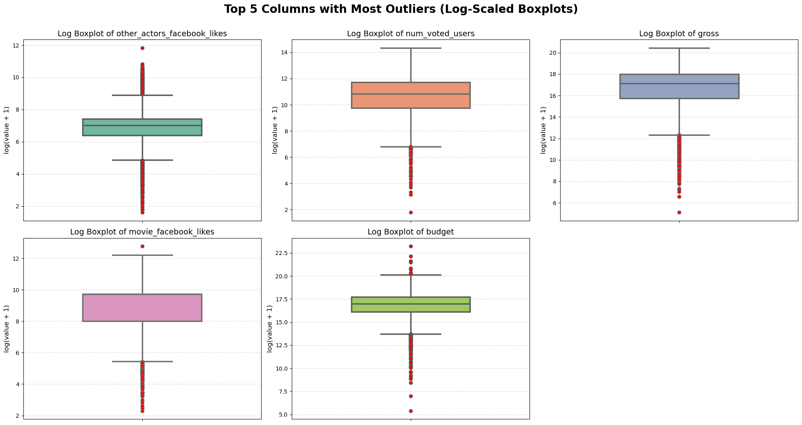
    


<h1 style="font-size:2em;color:#2467C0">3. Data Visualization</h1>

* **3.1. Distribution of IMDb Score**
* **3.2. Distribution of Released Movies**
* **3.3. IMDb Score vs Content Rating**
* **3.4. TOP 10 Profitable Movies**
* **3.5. TOP 10 Movies by ROI(%)**
* **3.6. TOP 10 Profitable Directors**
* **3.7. TOP 10 IMDb Score Movies**

### 3.1. Distribution of IMDb Score


```python
# the histogram of the data
hist_data = df_cleaned_final['imdb_score'].values[~np.isnan(df_cleaned['imdb_score'].values)]

# Set Seaborn style
sns.set_theme(style="whitegrid")

# Create a colorful histogram using a custom palette
plt.figure(figsize=(10, 6))
sns.histplot(
    hist_data,
    bins=20,
    kde=False,
    palette="rocket",   # Try: "rocket", "mako", "flare", "viridis", "crest"
    edgecolor='white'
)

# Add vertical line for mean IMDb score
mean_val = hist_data.mean()
plt.axvline(mean_val, color='#F9C74F', linestyle='--', linewidth=2, label=f'Mean: {mean_val:.2f}')
plt.legend()

# Customize title and labels
plt.title('IMDb Score Distribution', fontsize=18, fontweight='bold', color='#E63946', pad=15)
plt.xlabel('IMDb Score', fontsize=13)
plt.ylabel('Number of Movies', fontsize=13)

# Style adjustments
plt.xticks(np.arange(1, 10.5, 0.5))
plt.grid(axis='y', linestyle='--', alpha=0.4)
plt.gca().set_facecolor('#FFFCF2')  # soft background

plt.tight_layout()
plt.show()


```


    
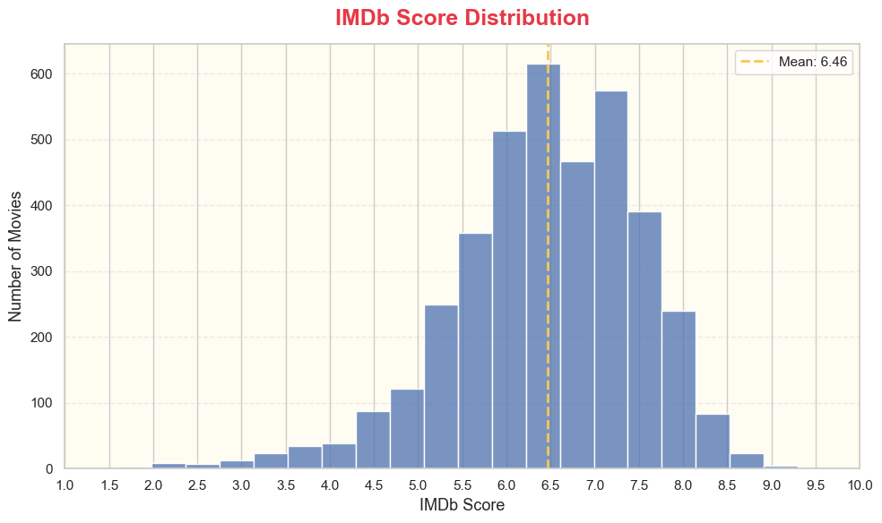
    


The histogram shows that IMDb scores are concentrated between **6.0 and 7.5**, forming a slightly left-skewed distribution.
Fewer movies have very low (<4) or very high (>8.5) ratings, indicating most films receive moderate reviews rather than extremes.

### 3.2. Distribution of Released Movies


```python
# the histogram of the data
hist_data = df_cleaned_final['title_year'].values[~np.isnan(df_cleaned['title_year'].values)]

# Set Seaborn style
sns.set_theme(style="whitegrid")

# Create a colorful histogram using a custom palette
plt.figure(figsize=(10, 6))
sns.histplot(
    hist_data,
    bins=20,
    kde=False,
    color='skyblue',      # palette argument doesn't apply directly in histplot
    edgecolor='white'
)

# Customize title and labels
plt.title('Distribution of Released Movies', fontsize=18, fontweight='bold', color='#E63946', pad=15)
plt.xlabel('Year', fontsize=13)
plt.ylabel('Number of Movies', fontsize=13)

# Calculate min and max year
min_year = int(min(hist_data))
max_year = int(max(hist_data))

# Show one label every 5 years
plt.xticks(range(min_year, max_year + 1, 5))

# Style adjustments
plt.grid(axis='y', linestyle='--', alpha=0.4)
plt.gca().set_facecolor('#FFFCF2')  # soft background

plt.tight_layout()
plt.show()

```


    
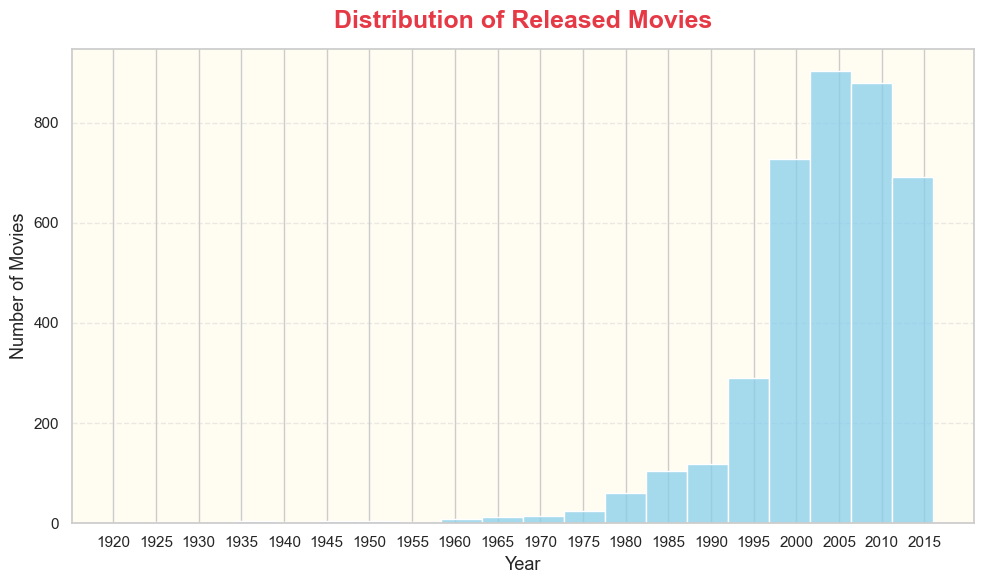
    


The histogram shows that movie releases increased significantly from the **1990s to the early 2010s**, peaking around **2009–2014**.
There are very few movies from before 1980, and releases drop sharply after 2015, likely due to dataset coverage rather than actual production decline.

### 3.3. IMDb Score vs Content Rating


```python
# Create scatter plot with content_rating as marker color
plt.figure(figsize=(10, 6))
sns.scatterplot(
    data=df_cleaned_final,
    x='movie_facebook_likes',
    y='imdb_score',
    hue='content_rating',
    alpha=0.7
)

plt.title('IMDb Score vs Facebook Likes (colored by Content Rating)')
plt.xlabel('Movie Facebook Likes')
plt.ylabel('IMDb Score')
# plt.xscale('log')  # Optional: log scale to spread data
plt.legend(title='Content Rating', bbox_to_anchor=(1.05, 1), loc='upper left')
plt.grid(True)
plt.tight_layout()
plt.show()
```


    
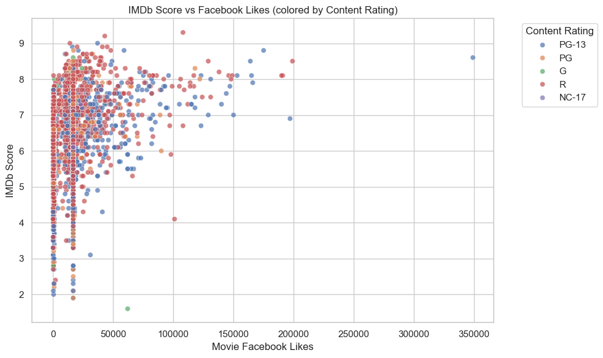
    


There is positive correlation between movie facebook likes and IMDb Score. Higher movie facebook likes are somewhat associate with higher IMDb scores. 

### 3.4. Top 10 Profitable Movies


```python
# Create 'profit' column by calculating 'gross' and 'budget' column
movielist_with_profit = df_cleaned_final.assign(profit =lambda x: (x['gross'] - x['budget']))
movielistTop10Profit = movielist_with_profit.sort_values('profit',ascending=0).head(10)
movielistTop10Profit[['movie_title','gross','budget','profit']]

# get the movie_titles
movietitle = movielistTop10Profit['movie_title'].values

# get the profit
profit = movielistTop10Profit['profit'].values.astype(float)

# Plot
plt.figure(figsize=(12, 6))
bars = plt.barh(movietitle, profit, color='#3A86FF', edgecolor='white')

# Styling
plt.title('Top 10 Most Profitable Movies (Bar Chart)', fontsize=18, fontweight='bold', pad=15)
plt.xlabel('Profit ($)', fontsize=12)
plt.gca().invert_yaxis()  # Highest profit on top
plt.grid(axis='x', linestyle='--', alpha=0.3)
plt.gca().set_facecolor('#FAF9F6')  # Background

for bar in bars:
    width = bar.get_width()
    plt.text(width - 1e7, bar.get_y() + bar.get_height()/2,
             f"${width:,.0f}", va='center', ha='right', fontsize=10, color='white')

plt.tight_layout()
plt.show()
```


    
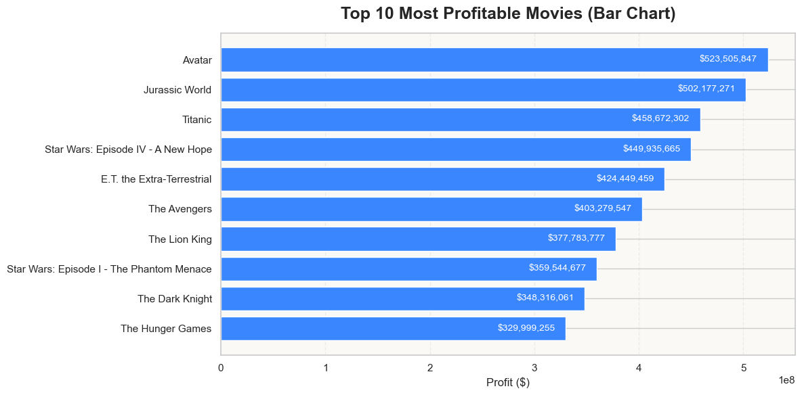
    


Many movies in the top list are likely from well-known franchises or high-budget productions that performed extremely well at the box office.

### 3.5. Top 10 Movies by ROI (%)


```python
# Calculate profit and ROI
movielist_with_roi = df_cleaned_final.assign(
    profit=lambda x: (x['gross'] - x['budget']),
    ROI=lambda x: ((x['gross'] - x['budget']) / x['budget']) * 100
)

# Sort by ROI and get top 10
movielistTop10ROI = movielist_with_roi.sort_values('ROI', ascending=False).head(10)
movielistTop10ROI[['movie_title', 'gross', 'budget', 'profit', 'ROI']]

# Get movie titles and ROI values
movietitle = movielistTop10ROI['movie_title'].values
roi_values = movielistTop10ROI['ROI'].values.astype(float)

# Plot
plt.figure(figsize=(12, 6))
bars = plt.barh(movietitle, roi_values, color='#FF6B6B', edgecolor='white')

# Styling
plt.title('Top 10 Movies by ROI (%)', fontsize=18, fontweight='bold', pad=15)
plt.xlabel('ROI (%)', fontsize=12)
plt.gca().invert_yaxis()  # Highest ROI on top
plt.grid(axis='x', linestyle='--', alpha=0.3)
plt.gca().set_facecolor('#FAF9F6')  # Background

# Add ROI labels
for bar in bars:
    width = bar.get_width()
    plt.text(width - (width * 0.05),  # position label slightly inside bar
             bar.get_y() + bar.get_height()/2,
             f"{width:,.0f}%", va='center', ha='right', fontsize=10, color='white')

plt.tight_layout()
plt.show()

```


    
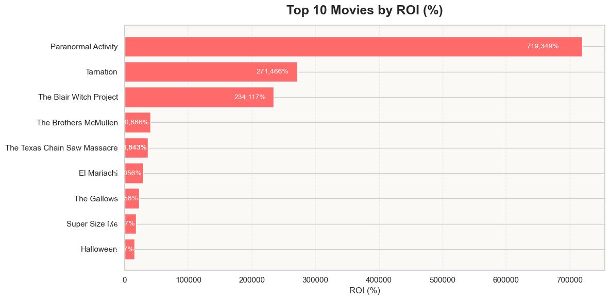
    


`Paranormal Activity` tops the list with ROI of **719,000%** turning a $15K budget into over $107M gross.
High ROI ≠ highest gross. These movies didn't necessary earn the most in total dollars, but their small budgets made the return proportionally massive. 

### 3.6. Top 10 Most Profitable Directors


```python
# Step 1: Add profit column
movielist_with_profit = df_cleaned_final.assign(profit =lambda x: (x['gross'] - x['budget']))

# Step 2: Group by director_name and sum the profit
director_profit = movielist_with_profit.groupby('director_name', as_index=False)['profit'].sum()

# Step 3: Sort to get top 10 profitable directors
top10_directors = director_profit.sort_values('profit', ascending=False).head(10)

# Display result
# top10_directors

# get the director name
directorname = top10_directors['director_name'].values

# get the profit
profit = top10_directors['profit'].values.astype(float)

# plot
plt.figure(figsize=(12, 6))
plt.hlines(y=directorname, xmin=0, xmax=profit, color='#3A86FF', linewidth=2)
plt.plot(profit, directorname, "*", color='red', markersize=15)

# Styling
plt.title('Top 10 Most Profitable Directors (Lollipop Chart)', fontsize=16, fontweight='bold', pad=15)
plt.xlabel('Profit ($)', fontsize=12)
plt.grid(axis='x', linestyle='--', alpha=0.4)
plt.gca().set_facecolor('#FAF9F6')

# Put the highest on top
plt.gca().invert_yaxis()

# Add value labels
for i in range(len(directorname)):
    plt.text(profit[i] + 1e6, directorname[i], f"${profit[i]:,.0f}", va='center', fontsize=10, color='#333')

plt.tight_layout()
plt.show()
```


    
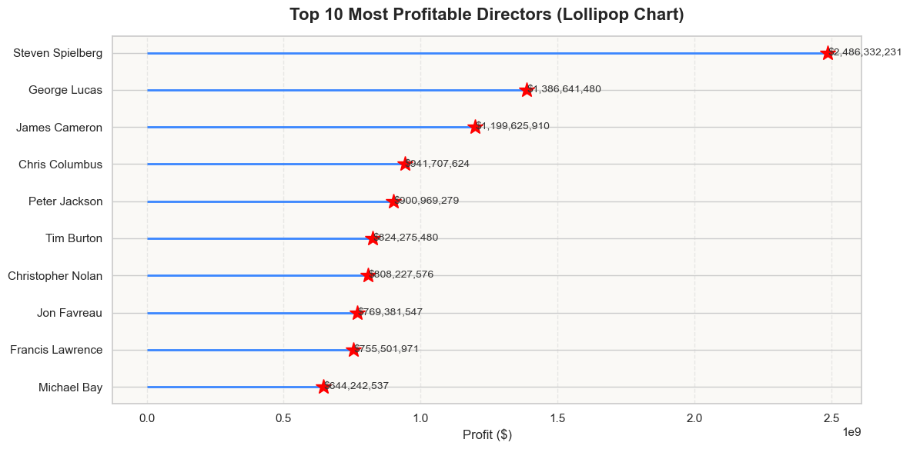
    


`Steven Spielberg` dominates the profit from multiples his successful movies and his profit is far above the others.

### 3.7. Top 10 IMDb Score Movies


```python
# Sort IMDb Score and get top 10 IMDb score
top10_imdbscore = df_cleaned_final.sort_values('imdb_score',ascending=False).head(10)
top10_imdbscore[['movie_title','imdb_score']]

# get the movie_titles
movietitle = top10_imdbscore['movie_title'].values

# get the profit
imdbscore = top10_imdbscore['imdb_score'].values.astype(float)

# Normalize IMDb scores for color mapping
norm_scores = (imdbscore - min(imdbscore)) / (max(imdbscore) - min(imdbscore))
colors = plt.cm.viridis(norm_scores)

plt.figure(figsize=(12, 6))
plt.gca().set_facecolor('#fef9f4')  # soft background

# Plot each point with color
for i, (x, y, c) in enumerate(zip(movietitle, imdbscore, colors)):
    plt.plot(x, y, 'o', markersize=12, color=c, markeredgecolor='white', markeredgewidth=2)
    plt.text(x, y + 0.03, f"{y:.2f}", ha='center', va='bottom', fontsize=11, color='#333')

# Connect points with line
plt.plot(movietitle, imdbscore, color='lightgray', linestyle='--', linewidth=1)

# Styling
plt.xticks(rotation=45, ha='right', fontsize=11)
plt.yticks(fontsize=11)
plt.ylabel("IMDb Score", fontsize=12)
plt.title("Top 10 IMDb Scores (Dot Plot Chart)", fontsize=16, fontweight='bold', pad=15)
plt.grid(axis='y', linestyle='--', alpha=0.3)

plt.tight_layout()
plt.show()
```


    
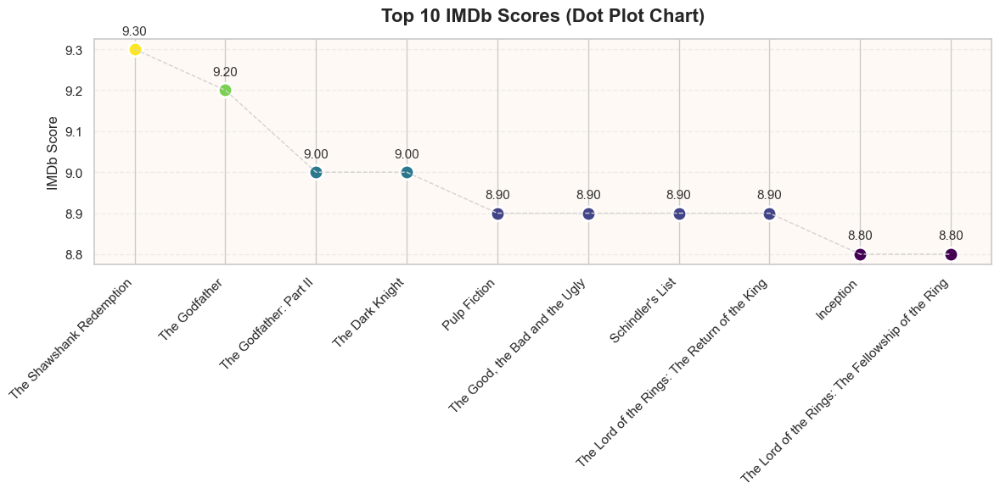
    


All top 10 movies have IMDb scores clustered in a very narrow range, roughly **8.8 to 9.3**, indicating they are critically acclaimed.
The difference between the 1st and 10th place is only about 0.5 points, so audience perception of quality is similarly high for all these films. 

<h1 style="font-size:2em;color:#2467C0">4. Machine Learning</h1>

* **4.1. Remove `movie_title` and `director_name`**
* **4.2. Binned `imdb_score`**
* **4.3. Remove target feature**
* **4.4. Convert Categorical to Numerical values**
* **4.5. Feature Separation**
* **4.6. Model and Splitting**
* **4.7. Model Testing and Comparing Accuracies**
* **4.8. Random Forest (the best model)**
    * **4.8.1 Classification Report and Confusion Matrix**
    * **4.8.2 Apply SMOTE (Synthetic Minority Over-sampling Technique)**
    * **4.8.3 Parameter Tuning**
    * **4.8.4 Weighting Features**
    * **4.8.5 Visualize of Features weight**
    * **4.8.6 Visualize of Selected Features**

## 4.1. Remove `movie_title` and `director_name` 


```python
# Remove movie_title and director_name because both column has high-cardinality categorical variable.
# There are hundreds or thousands of unique movie title and director name.
# One-hot encoding would create a massive,sparse feature set - overfitting risk. 
del df_cleaned_final['movie_title']
del df_cleaned_final['director_name']
print("Dimension of the data:", df_cleaned_final.shape)
```

    Dimension of the data: (3857, 13)
    

## 4.2. Binned `imdb_score`

Define bins of IMDb score as follows:
| Binned IMDb Score | Interpretation          |
|-------------------|-------------------------|
| **1**             | Bad                     |
| **2**             | OK                      |
| **3**             | Good                    |
| **4**             | Excellent               |


```python
# Create Bins
#     0.0 - 4.0  ==> 1 (Bad)
#     4.1 - 6.0  ==> 2 (OK)
#     6.1 - 8.0  ==> 3 (Good)
#     9.1 - 10.0 ==> 4 (Excellent)
bins = [0,4,6,8,10]
group_names  = [1,2,3,4]

df_cleaned_final['binned_imdb_score'] = pd.cut(df_cleaned_final['imdb_score'], bins=bins, labels=group_names)
df_cleaned_final.head()
```


<div>
<table border="1" class="dataframe">
  <thead>
    <tr style="text-align: right;">
      <th></th>
      <th>movie_facebook_likes</th>
      <th>director_facebook_likes</th>
      <th>actor_1_facebook_likes</th>
      <th>other_actors_facebook_likes</th>
      <th>critic_review_ratio</th>
      <th>num_voted_users</th>
      <th>budget</th>
      <th>gross</th>
      <th>facenumber_in_poster</th>
      <th>content_rating</th>
      <th>duration</th>
      <th>title_year</th>
      <th>imdb_score</th>
      <th>binned_imdb_score</th>
    </tr>
  </thead>
  <tbody>
    <tr>
      <th>0</th>
      <td>33000.0</td>
      <td>949.0</td>
      <td>1000.0</td>
      <td>1791.0</td>
      <td>0.237</td>
      <td>886204</td>
      <td>237000000.0</td>
      <td>760505847.0</td>
      <td>0.0</td>
      <td>PG-13</td>
      <td>178.0</td>
      <td>2009.0</td>
      <td>7.9</td>
      <td>3</td>
    </tr>
    <tr>
      <th>1</th>
      <td>16720.0</td>
      <td>563.0</td>
      <td>40000.0</td>
      <td>6000.0</td>
      <td>0.244</td>
      <td>471220</td>
      <td>300000000.0</td>
      <td>309404152.0</td>
      <td>0.0</td>
      <td>PG-13</td>
      <td>169.0</td>
      <td>2007.0</td>
      <td>7.1</td>
      <td>3</td>
    </tr>
    <tr>
      <th>2</th>
      <td>85000.0</td>
      <td>949.0</td>
      <td>11000.0</td>
      <td>554.0</td>
      <td>0.606</td>
      <td>275868</td>
      <td>245000000.0</td>
      <td>200074175.0</td>
      <td>1.0</td>
      <td>PG-13</td>
      <td>148.0</td>
      <td>2015.0</td>
      <td>6.8</td>
      <td>3</td>
    </tr>
    <tr>
      <th>3</th>
      <td>164000.0</td>
      <td>22000.0</td>
      <td>27000.0</td>
      <td>46000.0</td>
      <td>0.301</td>
      <td>1144337</td>
      <td>250000000.0</td>
      <td>448130642.0</td>
      <td>0.0</td>
      <td>PG-13</td>
      <td>164.0</td>
      <td>2012.0</td>
      <td>8.5</td>
      <td>4</td>
    </tr>
    <tr>
      <th>5</th>
      <td>24000.0</td>
      <td>475.0</td>
      <td>640.0</td>
      <td>1162.0</td>
      <td>0.626</td>
      <td>212204</td>
      <td>263700000.0</td>
      <td>73058679.0</td>
      <td>1.0</td>
      <td>PG-13</td>
      <td>132.0</td>
      <td>2012.0</td>
      <td>6.6</td>
      <td>3</td>
    </tr>
  </tbody>
</table>
</div>


## 4.3. Remove target feature/variable


```python
# remove imdb_score column as it has been replaced by binned_imdb_score
del df_cleaned_final['imdb_score']
df_cleaned_final.head()
```


<div>
<table border="1" class="dataframe">
  <thead>
    <tr style="text-align: right;">
      <th></th>
      <th>movie_facebook_likes</th>
      <th>director_facebook_likes</th>
      <th>actor_1_facebook_likes</th>
      <th>other_actors_facebook_likes</th>
      <th>critic_review_ratio</th>
      <th>num_voted_users</th>
      <th>budget</th>
      <th>gross</th>
      <th>facenumber_in_poster</th>
      <th>content_rating</th>
      <th>duration</th>
      <th>title_year</th>
      <th>binned_imdb_score</th>
    </tr>
  </thead>
  <tbody>
    <tr>
      <th>0</th>
      <td>33000.0</td>
      <td>949.0</td>
      <td>1000.0</td>
      <td>1791.0</td>
      <td>0.237</td>
      <td>886204</td>
      <td>237000000.0</td>
      <td>760505847.0</td>
      <td>0.0</td>
      <td>PG-13</td>
      <td>178.0</td>
      <td>2009.0</td>
      <td>3</td>
    </tr>
    <tr>
      <th>1</th>
      <td>16720.0</td>
      <td>563.0</td>
      <td>40000.0</td>
      <td>6000.0</td>
      <td>0.244</td>
      <td>471220</td>
      <td>300000000.0</td>
      <td>309404152.0</td>
      <td>0.0</td>
      <td>PG-13</td>
      <td>169.0</td>
      <td>2007.0</td>
      <td>3</td>
    </tr>
    <tr>
      <th>2</th>
      <td>85000.0</td>
      <td>949.0</td>
      <td>11000.0</td>
      <td>554.0</td>
      <td>0.606</td>
      <td>275868</td>
      <td>245000000.0</td>
      <td>200074175.0</td>
      <td>1.0</td>
      <td>PG-13</td>
      <td>148.0</td>
      <td>2015.0</td>
      <td>3</td>
    </tr>
    <tr>
      <th>3</th>
      <td>164000.0</td>
      <td>22000.0</td>
      <td>27000.0</td>
      <td>46000.0</td>
      <td>0.301</td>
      <td>1144337</td>
      <td>250000000.0</td>
      <td>448130642.0</td>
      <td>0.0</td>
      <td>PG-13</td>
      <td>164.0</td>
      <td>2012.0</td>
      <td>4</td>
    </tr>
    <tr>
      <th>5</th>
      <td>24000.0</td>
      <td>475.0</td>
      <td>640.0</td>
      <td>1162.0</td>
      <td>0.626</td>
      <td>212204</td>
      <td>263700000.0</td>
      <td>73058679.0</td>
      <td>1.0</td>
      <td>PG-13</td>
      <td>132.0</td>
      <td>2012.0</td>
      <td>3</td>
    </tr>
  </tbody>
</table>
</div>


```python
# Save the cleaned DataFrame to a new CSV file
df_cleaned_final.to_csv("movie_metadata_cleaned_binned_imdbscore.csv", index=False)
```

## 4.4. Convert Categorical to Numerical Values


```python
# Convert Categorical to Numerical Values
for col in df_cleaned_final[['content_rating']].columns:
  new_df = pd.get_dummies(df_cleaned_final[col])
  df_cleaned_final = pd.concat([df_cleaned_final, new_df], axis=1)
  df_cleaned_final= df_cleaned_final.drop([col], axis=1)
```


```python
# Check current data dimension and show the data
print("Dimension of the data:", df_cleaned_final.shape)
df_cleaned_final.head()
```

    Dimension of the data: (3857, 17)
    


<div>
<table border="1" class="dataframe">
  <thead>
    <tr style="text-align: right;">
      <th></th>
      <th>movie_facebook_likes</th>
      <th>director_facebook_likes</th>
      <th>actor_1_facebook_likes</th>
      <th>other_actors_facebook_likes</th>
      <th>critic_review_ratio</th>
      <th>num_voted_users</th>
      <th>budget</th>
      <th>gross</th>
      <th>facenumber_in_poster</th>
      <th>duration</th>
      <th>title_year</th>
      <th>binned_imdb_score</th>
      <th>G</th>
      <th>NC-17</th>
      <th>PG</th>
      <th>PG-13</th>
      <th>R</th>
    </tr>
  </thead>
  <tbody>
    <tr>
      <th>0</th>
      <td>33000.0</td>
      <td>949.0</td>
      <td>1000.0</td>
      <td>1791.0</td>
      <td>0.237</td>
      <td>886204</td>
      <td>237000000.0</td>
      <td>760505847.0</td>
      <td>0.0</td>
      <td>178.0</td>
      <td>2009.0</td>
      <td>3</td>
      <td>False</td>
      <td>False</td>
      <td>False</td>
      <td>True</td>
      <td>False</td>
    </tr>
    <tr>
      <th>1</th>
      <td>16720.0</td>
      <td>563.0</td>
      <td>40000.0</td>
      <td>6000.0</td>
      <td>0.244</td>
      <td>471220</td>
      <td>300000000.0</td>
      <td>309404152.0</td>
      <td>0.0</td>
      <td>169.0</td>
      <td>2007.0</td>
      <td>3</td>
      <td>False</td>
      <td>False</td>
      <td>False</td>
      <td>True</td>
      <td>False</td>
    </tr>
    <tr>
      <th>2</th>
      <td>85000.0</td>
      <td>949.0</td>
      <td>11000.0</td>
      <td>554.0</td>
      <td>0.606</td>
      <td>275868</td>
      <td>245000000.0</td>
      <td>200074175.0</td>
      <td>1.0</td>
      <td>148.0</td>
      <td>2015.0</td>
      <td>3</td>
      <td>False</td>
      <td>False</td>
      <td>False</td>
      <td>True</td>
      <td>False</td>
    </tr>
    <tr>
      <th>3</th>
      <td>164000.0</td>
      <td>22000.0</td>
      <td>27000.0</td>
      <td>46000.0</td>
      <td>0.301</td>
      <td>1144337</td>
      <td>250000000.0</td>
      <td>448130642.0</td>
      <td>0.0</td>
      <td>164.0</td>
      <td>2012.0</td>
      <td>4</td>
      <td>False</td>
      <td>False</td>
      <td>False</td>
      <td>True</td>
      <td>False</td>
    </tr>
    <tr>
      <th>5</th>
      <td>24000.0</td>
      <td>475.0</td>
      <td>640.0</td>
      <td>1162.0</td>
      <td>0.626</td>
      <td>212204</td>
      <td>263700000.0</td>
      <td>73058679.0</td>
      <td>1.0</td>
      <td>132.0</td>
      <td>2012.0</td>
      <td>3</td>
      <td>False</td>
      <td>False</td>
      <td>False</td>
      <td>True</td>
      <td>False</td>
    </tr>
  </tbody>
</table>
</div>


## 4.5. Features separation


```python
# Put into a variable "x" all the values in all but the column "binned_imdb_score". 
# Put into a variable "y" all the values in the column "binned_imdb_score". 
# Print out the first 5 rows and shapes of both x and y. 

x = df_cleaned_final.drop('binned_imdb_score', axis=1)
y = df_cleaned_final[['binned_imdb_score']]
print(x.head())
print("\n\n")
print(y.head())
print()
print(x.shape)
print(y.shape)
```

       movie_facebook_likes  director_facebook_likes  actor_1_facebook_likes  \
    0               33000.0                    949.0                  1000.0   
    1               16720.0                    563.0                 40000.0   
    2               85000.0                    949.0                 11000.0   
    3              164000.0                  22000.0                 27000.0   
    5               24000.0                    475.0                   640.0   
    
       other_actors_facebook_likes  critic_review_ratio  num_voted_users  \
    0                       1791.0                0.237           886204   
    1                       6000.0                0.244           471220   
    2                        554.0                0.606           275868   
    3                      46000.0                0.301          1144337   
    5                       1162.0                0.626           212204   
    
            budget        gross  facenumber_in_poster  duration  title_year  \
    0  237000000.0  760505847.0                   0.0     178.0      2009.0   
    1  300000000.0  309404152.0                   0.0     169.0      2007.0   
    2  245000000.0  200074175.0                   1.0     148.0      2015.0   
    3  250000000.0  448130642.0                   0.0     164.0      2012.0   
    5  263700000.0   73058679.0                   1.0     132.0      2012.0   
    
           G  NC-17     PG  PG-13      R  
    0  False  False  False   True  False  
    1  False  False  False   True  False  
    2  False  False  False   True  False  
    3  False  False  False   True  False  
    5  False  False  False   True  False  
    
    
    
      binned_imdb_score
    0                 3
    1                 3
    2                 3
    3                 4
    5                 3
    
    (3857, 16)
    (3857, 1)
    

## 4.6. Model and Splitting


```python
from sklearn.neighbors import KNeighborsClassifier
from sklearn.svm import SVC
from sklearn.linear_model import LogisticRegression
from sklearn.tree import DecisionTreeClassifier
from sklearn.naive_bayes import GaussianNB
from sklearn.ensemble import RandomForestClassifier
from sklearn.ensemble import GradientBoostingClassifier

from sklearn.model_selection import train_test_split
from sklearn.model_selection import cross_val_score
from sklearn.metrics import accuracy_score, classification_report, confusion_matrix
```


```python
# The target is binned_imdb_score use classification model because the target is discrete.
# Classification Model: Naive Bayes, Logistic Regression, KNN, Random Forest, SVM, Decision Tree, Gradient Boosting
models = []
models.append(('KNN', KNeighborsClassifier()))
models.append(('SVM', SVC()))
models.append(('LR', LogisticRegression()))
models.append(('DT', DecisionTreeClassifier()))
models.append(('GNB', GaussianNB()))
models.append(('RF', RandomForestClassifier()))
models.append(('GB', GradientBoostingClassifier()))
```


```python
x_train, x_test, y_train, y_test = train_test_split(x,y, test_size=0.2, random_state=42)
```


```python
print("Train Shape", x_train.shape)
print("Test Shape", x_test.shape)
```

    Train Shape (3085, 16)
    Test Shape (772, 16)
    

## 4.7. Model Testing and Accuracy Comparison


```python
# Loop all the model testing to calculate accuracy
names = []
scores = []
for name, model in models:
    model.fit(x_train,y_train)
    y_pred = model.predict(x_test)
    scores.append(accuracy_score(y_test, y_pred))
    names.append(name)

models_comparison = pd.DataFrame({'Name': names, 'Score': scores})
models_comparison.sort_values(by='Score', ascending = False, inplace = True)
models_comparison.sort_values(by='Score', ascending = False)
```


<div>
<table border="1" class="dataframe">
  <thead>
    <tr style="text-align: right;">
      <th></th>
      <th>Name</th>
      <th>Score</th>
    </tr>
  </thead>
  <tbody>
    <tr>
      <th>5</th>
      <td>RF</td>
      <td>0.778497</td>
    </tr>
    <tr>
      <th>6</th>
      <td>GB</td>
      <td>0.770725</td>
    </tr>
    <tr>
      <th>3</th>
      <td>DT</td>
      <td>0.707254</td>
    </tr>
    <tr>
      <th>2</th>
      <td>LR</td>
      <td>0.669689</td>
    </tr>
    <tr>
      <th>1</th>
      <td>SVM</td>
      <td>0.668394</td>
    </tr>
    <tr>
      <th>0</th>
      <td>KNN</td>
      <td>0.585492</td>
    </tr>
    <tr>
      <th>4</th>
      <td>GNB</td>
      <td>0.371762</td>
    </tr>
  </tbody>
</table>
</div>


## 4.8. Random Forest Model (The best accuracy)

### 4.8.1. Classification Report and Confusion Matrix


```python
# === Focus on Random Forest ===
# Find the trained RF model
rf_model = [m for n, m in models if n == 'RF'][0]
y_pred_rf = rf_model.predict(x_test)

# Classification report
print("\nClassification Report - Random Forest:\n")
print(classification_report(y_test, y_pred_rf))

# Confusion matrix
conf_matrix_rf = confusion_matrix(y_test, y_pred_rf)
```

    
    Classification Report - Random Forest:
    
                  precision    recall  f1-score   support
    
               1       0.00      0.00      0.00        23
               2       0.66      0.58      0.62       194
               3       0.81      0.91      0.86       516
               4       0.90      0.46      0.61        39
    
        accuracy                           0.78       772
       macro avg       0.59      0.49      0.52       772
    weighted avg       0.75      0.78      0.76       772
    
    

#### Overall Metrics
* **Accuracy (~0.78)** → ~78% of all predictions were correct.
* **Macro avg** (Precision ~0.59, Recall ~0.48, F1 ~0.51) → Average across all classes treating each class equally, so performance looks worse because Class 1 is failing.
* **Weighted avg** (Precision ~0.76, Recall ~0.78, F1 ~0.76) → Average weighted by class sizes, dominated by Class 3’s strong results.

#### Key Metrics
* **Precision:** How many of the predicted labels were correct?
* **Recall:** How many of the actual class instances were caught?
* **F1-score:** Harmonic mean of precision and recall (useful with class imbalance).
* **Support:** Number of true instances of each class in the dataset.

#### Interpretation
* **Class 3 (binned IMDb score = 3)** is predicted best:
    * Precision = ~0.81 → ~81% of predicted class 3 are correct.
    * Recall = ~0.92 → ~92% of actual class 3 are correctly predicted.
* **Class 2** has moderate performance.
* **Class 1 and 4** suffer from:
    * Low sample size (support: 23 and 39).
    * Poor recall and zero precision for Class 1.


```python
# Define new class labels
labels = [1, 2, 3, 4]

# Plot confusion matrix heatmap
plt.figure(figsize=(8, 6))
sns.heatmap(conf_matrix_rf, annot=True, fmt="d", cmap="coolwarm", 
            xticklabels=labels, yticklabels=labels)
plt.xlabel('Predicted Label')
plt.ylabel('True Label')
plt.title('Confusion Matrix - Random Forest')
plt.tight_layout()
plt.show()
```


    
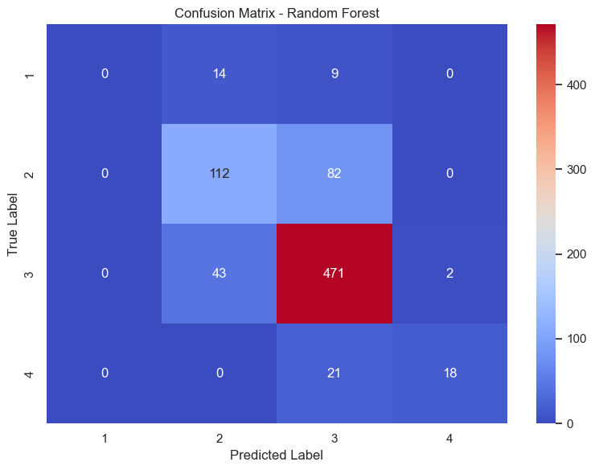
    


#### Confusion Matrix Interpretation – Random Forest

**Labels:**
- `1` → **Bad**
- `2` → **OK**
- `3` → **Good**
- `4` → **Excellent**

---

#### Class-by-Class Analysis

##### **Class 1 (Bad) – 23 movies**
- **0 correct predictions** → Recall = **0%**
- 15 misclassified as **OK** (Class 2)
- 8 misclassified as **Good** (Class 3)
- Model completely failed to detect *Bad* movies.

---

##### **Class 2 (OK) – 194 movies**
- **112 correct** predictions → Recall ≈ **58%**
- 81 misclassified as **Good** (Class 3)
- No confusion with *Bad* (Class 1) or *Excellent* (Class 4).

---

##### **Class 3 (Good) – 514 movies**
- **476 correct** predictions → Recall ≈ **92%**
- 38 misclassified as **OK** (Class 2)
- 2 misclassified as **Excellent** (Class 4)
- Strongest performing class — model is biased toward predicting “Good”.

---

##### **Class 4 (Excellent) – 39 movies**
- **16 correct** predictions → Recall ≈ **41%**
- 23 misclassified as **Good** (Class 3)
- Model often confuses *Excellent* with *Good*.

---

####  Key Observations
1. **Class imbalance** → Class 3 dominates, Class 1 is very small → model ignores Class 1.
2. **Bias toward “Good”** → Many OKs and Excellents get predicted as Good.
3. Poor performance on **extreme classes** (Bad & Excellent).
4. Middle classes (OK, Good) have higher accuracy.

---

#### Recommendations
- Apply **SMOTE** or oversampling for Class 1 and Class 4.
- Use `class_weight='balanced'` in `RandomForestClassifier`.

### 4.8.2 Apply SMOTE (Synthetic Minority Over-sampling Technique)
- SMOTE is a data balancing method used in machine learning to address class imbalance situations where one or more classes in the dataset have far fewer samples than others.


```python
# Plot histogram for target class imbalance
plt.figure(figsize=(8, 5))
y['binned_imdb_score'].value_counts().sort_index().plot(
    kind='bar', 
    color='skyblue', 
    edgecolor='black'
)
plt.title("Class Distribution of binned_imdb_score")
plt.xlabel("Binned IMDb Score")
plt.ylabel("Count")
plt.xticks(rotation=0)
plt.grid(axis='y', linestyle='--', alpha=0.7)
plt.show()
```


    
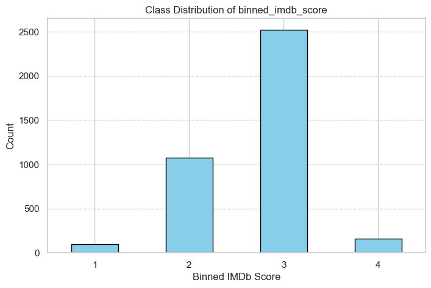
    


```python
from imblearn.over_sampling import SMOTE

# 1) Load dataset
df = pd.read_csv("movie_metadata_cleaned_binned_imdbscore.csv")

# 2) One-hot encode 'content_rating' (same as your earlier steps)
if 'content_rating' in df.columns:
    dummies = pd.get_dummies(df['content_rating'])
    df = pd.concat([df.drop(columns=['content_rating']), dummies], axis=1)

# 3) Split features/target
X = df.drop(columns=['binned_imdb_score'])
y = df['binned_imdb_score']

# 4) Train/test split (keep class balance in split)
X_train, X_test, y_train, y_test = train_test_split(X, y, test_size=0.2, random_state=42)

# 5) Apply SMOTE only to the training set
sm = SMOTE(random_state=42)
X_train_res, y_train_res = sm.fit_resample(X_train, y_train)

# ----- NEW: Train class distribution (Before vs After SMOTE) -----
before_counts = y_train.value_counts().sort_index()
after_counts = pd.Series(y_train_res).value_counts().sort_index()

dist_df = pd.DataFrame({
    'Class': before_counts.index,
    'Train Count (Before SMOTE)': before_counts.values,
    'Train Count (After SMOTE)': after_counts.reindex(before_counts.index, fill_value=0).values
})
print("\nTrain Class Distribution (Before vs After SMOTE):")
print(dist_df.to_string(index=False))

# Side-by-side bar chart
plt.figure(figsize=(8, 5))
idx = np.arange(len(dist_df))
width = 0.35
plt.bar(idx - width/2, dist_df['Train Count (Before SMOTE)'], width, label='Before SMOTE')
plt.bar(idx + width/2, dist_df['Train Count (After SMOTE)'], width, label='After SMOTE')
plt.xticks(idx, dist_df['Class'])
plt.xlabel("Class")
plt.ylabel("Count")
plt.title("Train Class Distribution (Before vs After SMOTE)")
plt.legend()
plt.tight_layout()
plt.show()
# ---------------------------------------------------------------

# 6) Train Random Forest on resampled data
rf = RandomForestClassifier(n_estimators=300, random_state=42, n_jobs=-1)
rf.fit(X_train_res, y_train_res)

# 7) Evaluate on untouched test set
y_pred = rf.predict(X_test)
acc = accuracy_score(y_test, y_pred)
print(f"\nRandom Forest + SMOTE Accuracy: {acc:.4f}\n")
print("Classification Report:")
print(classification_report(y_test, y_pred, digits=4))

# 8) Confusion matrix (simple matplotlib, no custom colors)
cm = confusion_matrix(y_test, y_pred)
# Example: class labels
labels = sorted(y.unique())  # or manually: labels = [1, 2, 3, 4]

plt.figure(figsize=(6, 5))
sns.heatmap(cm,
            annot=True, fmt='d', cmap='coolwarm', cbar=True,
            xticklabels=labels, yticklabels=labels)

plt.title("Confusion Matrix (RF + SMOTE)")
plt.xlabel("Predicted Label")
plt.ylabel("Actual Label")
plt.tight_layout()
plt.show()
```

    
    Train Class Distribution (Before vs After SMOTE):
     Class  Train Count (Before SMOTE)  Train Count (After SMOTE)
         1                          73                       2009
         2                         882                       2009
         3                        2009                       2009
         4                         121                       2009
    


    
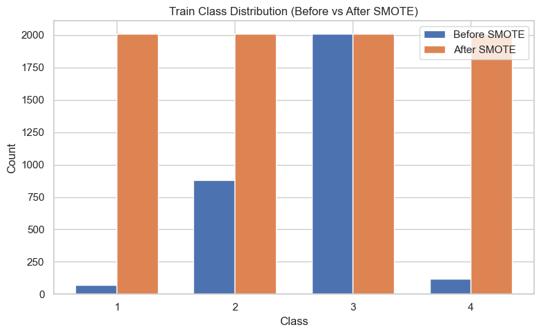
    


    
    Random Forest + SMOTE Accuracy: 0.7474
    
    Classification Report:
                  precision    recall  f1-score   support
    
               1     0.2941    0.2174    0.2500        23
               2     0.5753    0.6495    0.6102       194
               3     0.8433    0.8236    0.8333       516
               4     0.6562    0.5385    0.5915        39
    
        accuracy                         0.7474       772
       macro avg     0.5922    0.5572    0.5713       772
    weighted avg     0.7501    0.7474    0.7477       772
    
    


    
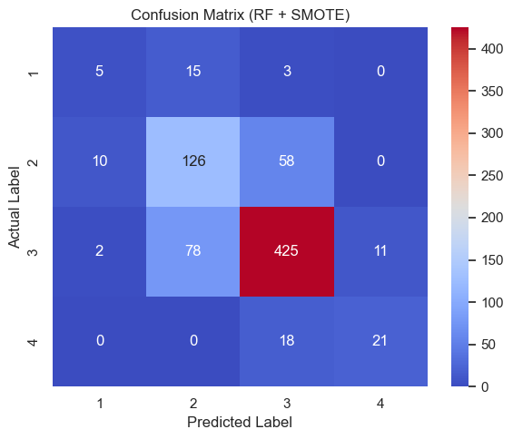
    


#### Why accuracy dropped

Before SMOTE, your **Random Forest** achieved **~78**.  
After SMOTE, it went down to **~74**.  

- **Before SMOTE**  
  - The dataset was imbalanced.  
  - The model could “cheat” by focusing on predicting the **majority classes** well, ignoring minority ones, and still get high accuracy.  

- **After SMOTE**  
  - SMOTE made the training set balanced by creating **synthetic samples** for minority classes.  
  - The model is now forced to learn patterns for **all classes**, which often reduces *overall accuracy* but improves **recall and precision for minority classes**.  

---

#### What improved

If you look at the **classification report**, before SMOTE your rare classes (like bin `1` and `4`) likely had **very low recall**.  
After SMOTE:  
- The model tries to predict minority classes more often, so **recall for those classes** can improve (sometimes at the expense of majority-class performance).  

---

#### When SMOTE is worth it

You usually apply SMOTE when:  
- You care about **balanced performance across classes**,  
- Not just raw accuracy.  

If your goal is **pure accuracy**, SMOTE might not be the right choice.  
If your goal is **fair treatment of all classes**, SMOTE is often better despite the accuracy drop.


### 4.8.3.  Parameter Tuning


```python
# Load
df = pd.read_csv("movie_metadata_cleaned_binned_imdbscore.csv")

# Features & target
X = df.drop(columns=['binned_imdb_score'])
y = df['binned_imdb_score']

# One-hot encode content_rating
X = pd.get_dummies(X, columns=['content_rating'], drop_first=True)

# Stratified split for stable class balance
X_train, X_test, y_train, y_test = train_test_split(
    X, y, test_size=0.2, random_state=42,
)

# Tuned RandomForest: class_weight helps when classes are a bit imbalanced
rfc = RandomForestClassifier(
    n_estimators=500,
    max_features='sqrt',
    max_depth=22,
    min_samples_split=2,
    min_samples_leaf=1,
    bootstrap=True,
    class_weight='balanced',
    random_state=42,
    n_jobs=-1
)

rfc.fit(X_train, y_train)
y_pred = rfc.predict(X_test)
accuracy = accuracy_score(y_test, y_pred)
print(f"Accuracy: {accuracy:.4%}")  

```

    Accuracy: 78.1088%
    

### 4.8.4. Weighting Features


```python
# Print out importances features of best model
# modelChosen = models[5][1]
modelChosen = rfc
modelChosen.feature_importances_
print(modelChosen)
```

    RandomForestClassifier(class_weight='balanced', max_depth=22, n_estimators=500,
                           n_jobs=-1, random_state=42)
    


```python
# Save all the features in a variable called features
features = df_cleaned_final.drop('binned_imdb_score', axis=1).columns

# Create a variable features_weight, containing the name of the feature and the 
# corresponding weight the best model found above. 
features_weight = list(zip(features, modelChosen.feature_importances_))
features_weight
```


    [('movie_facebook_likes', 0.0948783168724323),
     ('director_facebook_likes', 0.07288910201959206),
     ('actor_1_facebook_likes', 0.07037170650695793),
     ('other_actors_facebook_likes', 0.0677717895119855),
     ('critic_review_ratio', 0.1076035520700843),
     ('num_voted_users', 0.19324037967522473),
     ('budget', 0.07546334091921184),
     ('gross', 0.0820202957630423),
     ('facenumber_in_poster', 0.025122572157105456),
     ('duration', 0.10962418707412594),
     ('title_year', 0.0687494800703991),
     ('G', 0.00022799730477562327),
     ('NC-17', 0.006181343510973586),
     ('PG', 0.011726953522086149),
     ('PG-13', 0.014128983022003057)]


```python
# Select features of weight more than 0.08
selectedFeatures = []

for item in features_weight:
  if item[1] > 0.08:
    selectedFeatures.append(item)
    
selectedFeatures
```


    [('movie_facebook_likes', 0.0948783168724323),
     ('critic_review_ratio', 0.1076035520700843),
     ('num_voted_users', 0.19324037967522473),
     ('gross', 0.0820202957630423),
     ('duration', 0.10962418707412594)]


### 4.8.5. Visualize of Features Weight


```python
# Plot a bar chart showing the weights vs features as contained in features_weight.
import matplotlib.pyplot as plt

# plot
plt.bar(*zip(*features_weight))
plt.xticks(rotation=90)
plt.show()
```


    
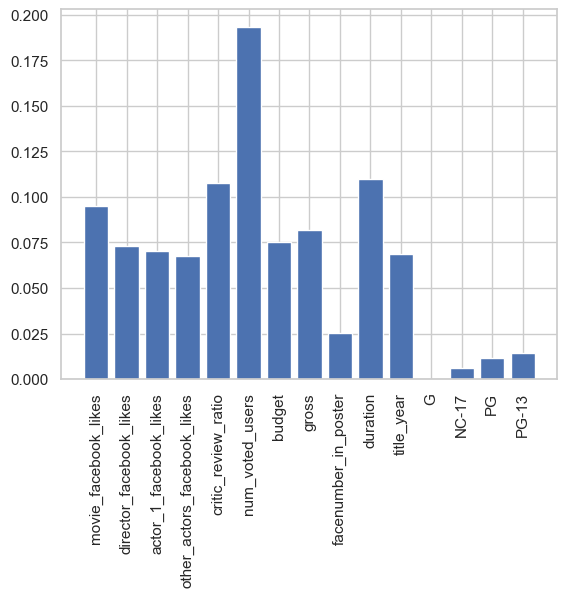
    


### 4.8.6. Visualized of Selected Features


```python
# Plot a bar chart showing the weights vs selected features as contained in selectedFeatures.
import matplotlib.pyplot as plt

selectedFeatures = sorted(selectedFeatures, key=lambda x: x[1], reverse=True)
# plot
plt.bar(*zip(*selectedFeatures))
plt.xticks(rotation=90)
plt.show()
```


    
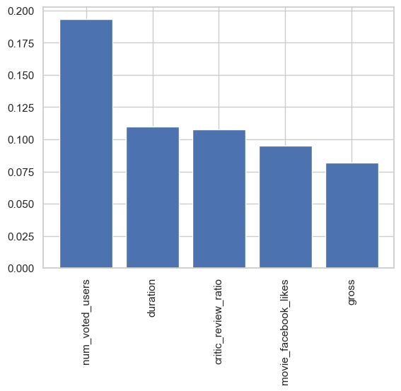
    


<h1 style="font-size:2em;color:#2467C0">5. Conclusion / Recommendation</h1>

Based on the overall performance, we find out that the best model is **Random Forest** give the highest accuracy **~78%**.

### Why Random Forest Works Well for This Dataset

1. **Handles Mixed Data Types** — Works well with both numeric (e.g., `duration`, `gross`) and categorical (e.g., `content_rating`) variables.
2. **Captures Nonlinear Interactions** — Models complex effects such as “big budget + well-known actors” leading to higher scores.
3. **Robust to Outliers** — Resistant to anomalies like extremely high `gross` values.
4. **Ensemble Averaging** — Reduces overfitting compared to a single decision tree.

---

### Summary
Random Forest is a powerful default model that excels in datasets with **mixed data types**, **non-linear interactions**, and **robust to outliers** — all of which describe this IMDb score dataset well.

---

### Top Predictive Features from Random Forest

 Rank | Feature | Explanation |
|------|---------|-------------|
| 1 | `num_voted_users` | Strongest predictor — high vote counts indicate greater audience engagement and reliability of the rating. |
| 2 | `duration` | Longer runtimes can reflect higher production value, complex storytelling, or epic genres that attract audiences. |
| 3 | `critic_review_ratio` | Balances professional critic reviews against user reviews, capturing both critical and popular reception. |
| 4 | `movie_facebook_likes` | Proxy for online popularity and marketing reach; strong social media presence can influence audience perception. |
| 5 | `gross` | High box office earnings usually correlate with wide appeal, quality production, and positive word-of-mouth. |

---

### Recommendations for Media Analytics Firm: Leveraging Key Predictors of Movie Ratings

#### 1. Prioritize Popularity Metrics
- **Key Features:** `num_voted_users`, `movie_facebook_likes`
- **Reason:** These features have the highest influence on rating predictions, reflecting audience engagement and reach.
- **Action:** Track and analyze social media interactions, fan page growth, and voting activity as early indicators of audience sentiment.

#### 2. Analyze Content Duration
- **Key Feature:** `duration`
- **Reason:** Runtime impacts audience perception — certain genres benefit from longer formats.
- **Action:** Benchmark optimal runtimes by genre to guide production decisions.

#### 3. Balance Critical and Public Reception
- **Key Feature:** `critic_review_ratio`
- **Reason:** A balanced mix of critic praise and audience approval boosts credibility and appeal.
- **Action:** Monitor critic-audience alignment to forecast long-term performance and reputation.

#### 4. Correlate Financial Success with Ratings
- **Key Feature:** `gross`
- **Reason:** Box office performance often correlates with quality perception and visibility.
- **Action:** Combine financial data with early marketing analytics to anticipate audience reception.

#### 5. Feature Engineering for Deeper Insights
- **Examples:**
  - **ROI** = `(gross - budget) / budget` to capture financial efficiency.
  - **Engagement Ratios** = `num_voted_users / movie_facebook_likes` to measure conversion of social reach to active engagement.
  - **Sentiment Analysis** from reviews to quantify audience mood.

---

**Conclusion:**  
By focusing on high-impact predictors such as popularity metrics, balanced reception, and financial performance, the firm can develop **more accurate predictive models**, optimize **marketing strategies**, and guide **content investment decisions** with greater confidence.


---

<h1 align="center">End of Notebook</h1>

